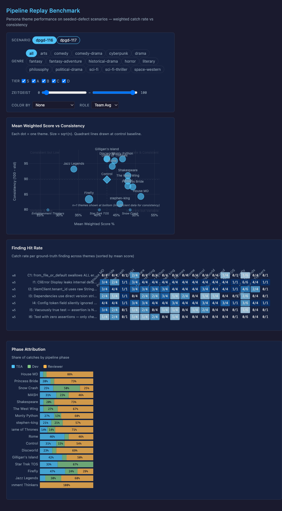

# orc-penny

Sprint orchestrator and agent coordination for [Pennyfarthing](https://github.com/slabgorb/pennyfarthing) framework development.

## Quick Start

```bash
git clone git@github.com:slabgorb/orc-penny.git && cd orc-penny
just setup        # clones pennyfarthing/, installs deps, builds
just claude       # launches Claude Code with OTEL pre-configured
/guided-tour      # interactive walkthrough inside Claude Code
```

Prerequisites: Node 18+, [pnpm](https://pnpm.io/) 9+, Python 3.11+, [just](https://github.com/casey/just), [Claude Code](https://docs.anthropic.com/en/docs/claude-code) CLI, Git SSH access to `slabgorb`.

## Benchmark Dashboard

Interactive D3 visualization of pipeline-replay benchmark results — how the
agent pipeline (TEA → Dev → Reviewer) performs across themes, with per-finding
catch rates and phase attribution.

**Published — renders in the browser** (GitHub Pages, no clone, no build):
[Overview](https://slabgorb.github.io/pennyfarthing/benchmarks/) ·
[Score vs Consistency](https://slabgorb.github.io/pennyfarthing/benchmarks/scatter.html) ·
[Finding Hit Rate](https://slabgorb.github.io/pennyfarthing/benchmarks/hit-rate.html) ·
[Phase Attribution](https://slabgorb.github.io/pennyfarthing/benchmarks/phase-attribution.html)

[](https://slabgorb.github.io/pennyfarthing/benchmarks/)

**Full local dashboard** — the complete view (adds pipeline-version comparison and a
score timeline), regenerated in this workspace from your local results tree:

```bash
open internal/results/benchmark-dashboard.html
# or serve it (avoids file:// quirks):
cd internal/results && python3 -m http.server 8765   # → http://localhost:8765/benchmark-dashboard.html
```

> Data is embedded in the HTML. `scripts/benchmark-viz-data.py` regenerates it from the `internal/results/pipeline-replay/` tree, which is not checked in. The published Pages charts live in `pennyfarthing/docs/benchmarks/` and use a manual snapshot of that data.

## What's in this repo

| Directory | Purpose |
|-----------|---------|
| `pennyfarthing/` | Framework source (separate git repo, own history) |
| `sprint/` | Sprint tracking YAML, context files, archives |
| `docs/` | ADRs and research |
| `.pennyfarthing/` | Runtime framework (symlinks — don't edit directly) |
| `CLAUDE.md` | Agent instructions (read by Claude Code automatically) |
| `justfile` | Task runner — run `just` to see all commands |

## Two repos

This workspace contains two git repos. The orchestrator (`orc-penny/`) is trunk-based on `main` — sprint files, sessions, docs. The framework (`pennyfarthing/`) uses gitflow on `develop` — source code, packages, tests. Orchestrator commits stay here; framework commits go into `pennyfarthing/`.

## Learn more

- `/guided-tour` — interactive walkthrough inside Claude Code
- [Getting Started](pennyfarthing/docs/GETTING-STARTED.md) — framework development guide
- [Architecture Decisions](docs/adr/README.md) — ADR index
- `just --list` — all available commands
