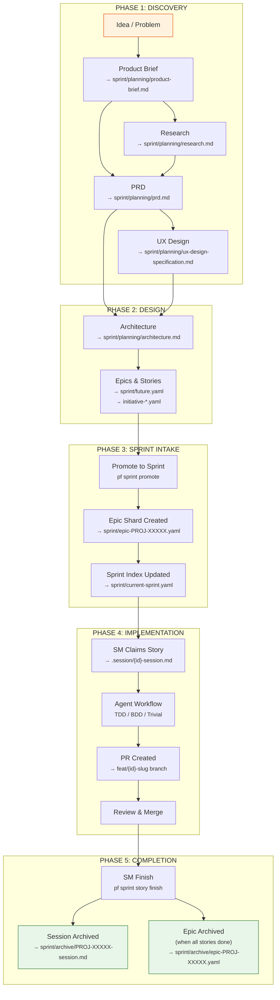
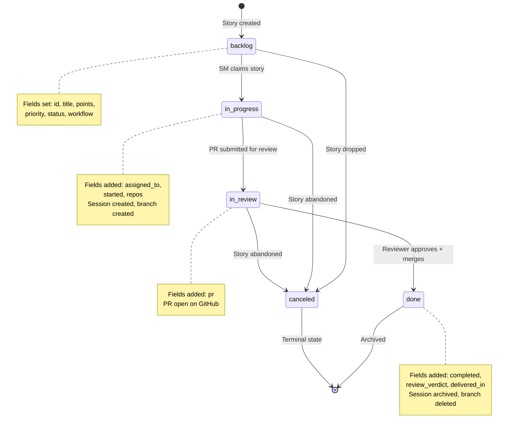
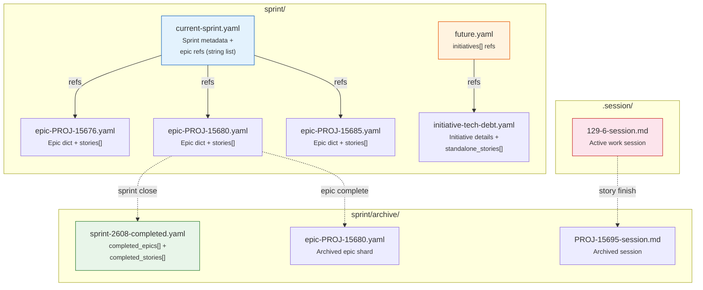
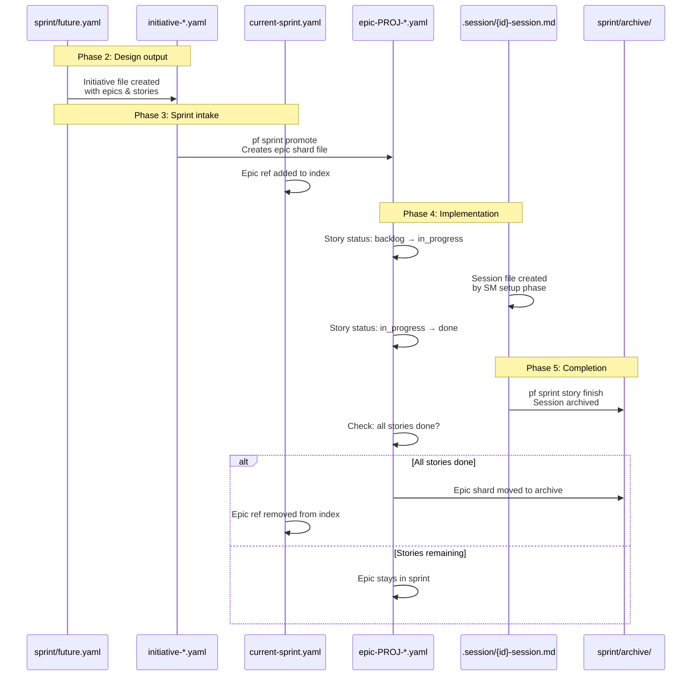
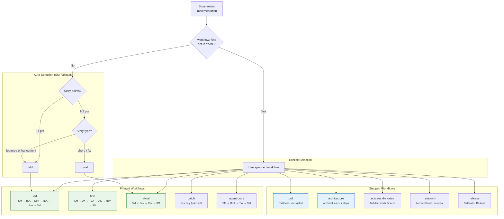
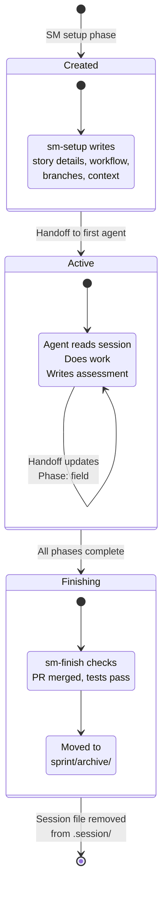
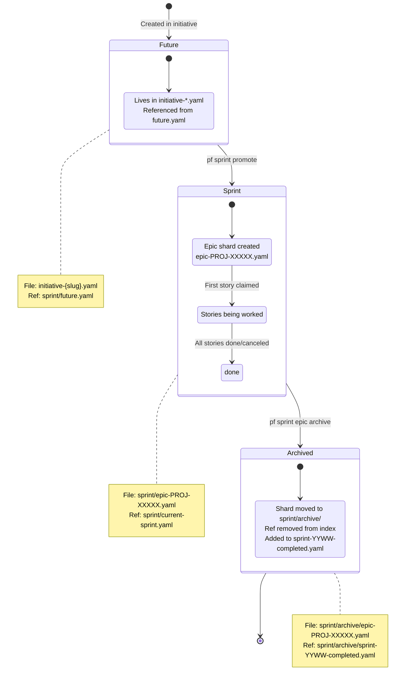
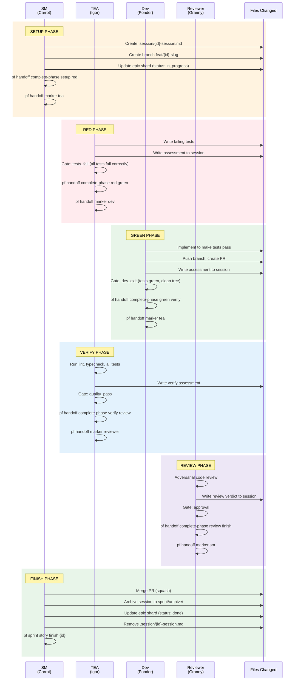

# Feature Journey: From Concept to Archive

How a feature moves through the Pennyfarthing system — the files, states, and transitions that carry an idea from inception to completed work. Companion to [lifecycle-workflow-maps.md](lifecycle-workflow-maps.md) which covers agent workflows.

---

## 1. The Full Journey (Macro View)

A feature passes through five phases. Each phase produces artifacts consumed by the next.



---

## 2. Story State Machine

Every story follows this state machine. Transitions are enforced by `pf sprint story` commands — never by direct YAML edits.



---

## 3. Sprint File Structure

Sprint data is **sharded** — the index file references epic shards by Jira key, and each shard contains its own stories. The loader merges them transparently.



### Sprint Index (`current-sprint.yaml`)

```yaml
sprint:
  name: "TO Sprint 2608"
  jira_sprint_id: 310
  goal: "Installation, agents and workflows"
  start_date: '2026-02-16'
  end_date: '2026-03-01'
  status: active

epics:              # String refs → shard files
  - PROJ-15676
  - PROJ-15680
  - PROJ-15685

stories: []         # Orphan stories (not in epics)
standalone_stories: []
```

### Epic Shard (`epic-PROJ-15680.yaml`)

```yaml
id: '129'
type: epic
title: 'Epic: Hook System & Installation'
priority: P1
status: in_progress
jira: PROJ-15680
repos: pennyfarthing
points: 16
stories:
  - id: 129-1
    jira: PROJ-15681
    title: Story title here
    points: 2
    priority: P1
    status: done
    workflow: tdd
    completed: '2026-02-20'
  - id: 129-2
    # ...more stories
```

---

## 4. Initiative → Sprint → Archive Flow

The file-level journey of a feature from future backlog to archived history.



---

## 5. BikeLane Workflow Selection

When a story enters implementation, BikeLane selects the orchestration pattern. The story's `workflow` field determines which agent chain runs.



### Phased vs Stepped

| Aspect | Phased | Stepped |
|--------|--------|---------|
| **Pacing** | Machine-driven | Human-gated |
| **Agents** | Chain with handoffs | Single agent guides user |
| **Gates** | Automatic quality checks | User confirms at each gate |
| **Session** | `.session/{id}-session.md` | BikeLane step tracking |
| **Purpose** | Implementation | Discovery & planning |
| **Start** | `pf sprint work {id}` | `/pf-workflow start {name}` |

---

## 6. Session File Lifecycle

The session file is the heartbeat of an active story. It tracks which agent owns the current phase and records each agent's assessment.



### Session File Structure

```
.session/129-6-session.md
├── Story Details (ID, Jira, Workflow, Assigned)
├── Description
├── Workflow Tracking
│   ├── Phase: (current phase)
│   ├── Phase Started: (ISO timestamp)
│   └── Phase History (table of all phases)
├── SM Assessment
├── TEA Assessment
├── Dev Assessment
├── TEA Verify Assessment
└── Reviewer Assessment
```

---

## 7. Epic Lifecycle

Epics are containers for related stories. They live as shard files alongside the sprint index.



---

## 8. The Handoff Chain (TDD Example)

How control passes between agents during a TDD story, with the files touched at each step.



---

## Cross-Reference

| Topic | Document |
|-------|----------|
| Agent workflows and selection logic | [lifecycle-workflow-maps.md](lifecycle-workflow-maps.md) |
| Tier definitions (discovery → implementation) | [lifecycle-tier-definitions.md](lifecycle-tier-definitions.md) |
| Tier work products | [lifecycle-tier-work-products.md](lifecycle-tier-work-products.md) |
| Pre-epic sketch conventions | [pre-epic-sketch-convention.md](../../conventions/pre-epic-sketch-convention.md) |
| BikeLane engine details | `pennyfarthing/pennyfarthing-dist/guides/bikelane.md` |
| Handoff CLI reference | `pennyfarthing/pennyfarthing-dist/guides/handoff-cli.md` |
| Gate system | `pennyfarthing/pennyfarthing-dist/guides/gates.md` |
