# Product Brief: Composable Lifecycle Engine

**Author:** Michael Pursifull (BA discovery by Avasarala)
**Date:** 2026-02-14
**Status:** Draft — For Team Review
**Context:** Spec-driven development with AI agent execution (Pennyfarthing/BikeLane)

---

## Executive Summary

BMAD introduced spec-driven AI development — structured planning artifacts, agent personas, stepped workflows — and it works well for greenfield projects built by a single developer. Beyond that envelope, eight structural problems emerge: the lifecycle stops at "shipped" with no feedback loops; the process doesn't scale up (multi-epic, multi-contributor) or down (bug fixes, spikes, features); the human is the integration bus between agents; the workflow mechanism is one-size-fits-all; post-1.0 work has no entry points; implementation drift is invisible; spec changes ripple without tracking; and flat-file context collapses as projects grow.

**Measured data** from five projects confirms the context scaling problem: a 25-epic BMAD project consumed 97% of the context window before any work began. This ceiling applies to any file-backed spec-driven approach, not just BMAD.

**The proposal:** Extend the lifecycle into a loop (LEARN phase), add input channels beyond "new story," make the lifecycle fractal (same pattern at product/feature/spike scale), introduce composable workflows (variants, overlays, chains), and explore context intelligence (indexed retrieval, knowledge graphs). Phase 1 is concrete; later phases are directional and contingent on learnings. Context intelligence (Phase 5) is a research direction, not a known solution.

**What we're asking:** Review this brief, challenge the problem framing, and decide whether to proceed to discovery on the first phase.

---

## The Problem in One Sentence

The BMAD product lifecycle is a one-way street with one front door: it starts at "product brief," ends at "story shipped," has no feedback loops, no way to handle external change, no mechanism for exploration, and no way to run the same process at different scales.

> **Note:** There are additional structural problems — the human-as-integration-bus handoff model, the single flat workflow type, the absence of quality gates, and a flat-file context architecture that collapses under its own weight as projects grow — some of which are explored in companion documents. The need for a Composable Lifecycle Engine follows directly from the sentence above: every clause is a gap that must be closed.

---

## Document Map

| Section | |
|---------|---|
| **What's Actually Broken (1–8)** | Eight structural problems with BMAD's lifecycle model |
| **The Vision (A–F)** | Six design goals for what replaces it *(early draft)* |
| **Why This Matters / Proposal / Metrics** | Spec-driven AI argument, phased build plan, success criteria |
| **Risks, Precedent, Next Steps** | Open questions, industry grounding, immediate actions |

**Companion documents:**

| Document | Purpose |
|----------|---------|
| [Lifecycle Composition Index](INDEX.md) | Initiative tracker — all documents, research tracks, and progress |
| [BMAD vs Pennyfarthing](../../comparisons/bmad-vs-pennyfarthing.md) | Feature-by-feature comparison, "left vs right" framework |
| [Gap Analysis](../../comparisons/bmad-pennyfarthing-gap-analysis.md) | Agent, workflow, and infrastructure gaps between BMAD and Pennyfarthing |
| [BMAD Integration](../../../sprint/planning/bmad-integration.md) | How BMAD and Pennyfarthing work together today |
| [Gate Extraction Epics](../../../sprint/planning/gate-epics.md) | Declarative gate system — epic and story breakdown |
| [Tier Communication Protocol](lifecycle-tier-comm-protocol.md) | Channel taxonomy for inter-tier communication (Finding, Intent, Alert, etc.) |
| [Tier Definitions](lifecycle-tier-definitions.md) | Formal tier definitions with VSM S1–S5 mapping |
| [Research Synthesis](lifecycle-research-synthesis.md) | Unified synthesis across five research tracks (171 sources) |
| [BMAD Multi-Dev Lessons Learned](../../../ccmp/_bmad-output/bmad-multi-dev-lessons-learned.md) | Team-scale BMAD usage: solo tool finding, gate discovery, quality trajectory |
| [OCSF Spike Findings](../../../poller-orchestrator/sprint/planning/spike-findings-ocsf.md) | Validated spike lifecycle model; lessons on charter-first exploration |
| [Axiathon Divergence Analysis](../../../poller-orchestrator/sprint/planning/axiathon-ocsf-divergence-alignment-analysis.md) | Cross-project analysis of BMAD-generated architecture failures |
| [Context Window Measurement Procedure](data/context-window-measurement-procedure.md) | Repeatable methodology for measuring context consumption at session start |
| [Context Window Measurement Results](data/context-window-measurement-results.md) | Empirical data from 5 projects (3 BMAD, 2 Pennyfarthing) — grounds section 8 charts |

---

## What's Actually Broken

### 1. The lifecycle is incomplete — it stops at "shipped"

```mermaid
graph LR
    subgraph "What BMAD covers today"
        PB["Product<br/>Brief"] --> PRD["PRD"] --> ARCH["Architecture"]
        ARCH --> ES["Epics &<br/>Stories"] --> SP["Sprint<br/>Planning"] --> IMPL["TDD/BDD<br/>Implementation"]
        IMPL --> REL["Release"]
    end

    subgraph "What happens next (not covered)"
        INT["Integration<br/>Validation"]
        DRIFT["Architectural<br/>Drift Detection"]
        FB["User<br/>Feedback"]
        LEARN["Learning<br/>Capture"]
        PROP["Change<br/>Propagation"]
    end

    REL -.->|"???"| INT
    INT -.->|"???"| DRIFT
    DRIFT -.->|"???"| FB
    FB -.->|"???"| LEARN
    LEARN -.->|"???"| PROP
    PROP -.->|"should feed back"| PRD

    style INT fill:#546e7a,stroke:#29434e,color:#fff
    style DRIFT fill:#546e7a,stroke:#29434e,color:#fff
    style FB fill:#546e7a,stroke:#29434e,color:#fff
    style LEARN fill:#546e7a,stroke:#29434e,color:#fff
    style PROP fill:#546e7a,stroke:#29434e,color:#fff
```

After release, BMAD provides no structured process for:
- **Integration validation** — Did the features actually work together?
- **Architectural drift** — Did implementation diverge from the architecture? Is that okay?
- **Learning capture** — What did we learn that should update the PRD or Architecture?
- **Change propagation** — When a spec changes, what downstream artifacts are now stale?

The BMAD lifecycle is a pipeline, not a loop. In practice, teams handle post-ship work through ad-hoc heroics. The lifecycle composition research synthesis [@pursifull_2026h] validated this gap against five research tracks (~171 sources); the absence of feedback loops violates Beer's recursive viability theorem — the principle that any viable system must contain a model of itself that includes feedback from its own outputs [@beer_1972] — and Ashby's law of requisite variety, which requires that a system's regulatory capacity match the variety of disturbances it faces [@ashby_1956].

> **A note on citations.** This document cites extensively from the author's own project analyses (`@pursifull_2026a` through `@pursifull_2026v`). These citations provide traceability to companion documents — lessons learned, spike findings, gap analyses, measurement data — not independent validation. The evidence base is primarily one team's experience across a handful of projects. Where claims require independent support, external sources are cited separately. Readers should treat internal citations as "we observed this; here's where we documented it" rather than "the literature establishes this."

### 2. BMAD was built for one scale — and it's a narrow one

BMAD's lifecycle works well for **well-defined greenfield projects**: a focused SaaS MVP, a purpose-built utility, a greenfield 1.0 built end-to-end by one person using well-known, common technologies with well-understood interfaces. In that context — purely software, one developer, one pass from brief to release, no external system dependencies — the process delivers real value. This is not a trivial use case; it represents a significant portion of AI-assisted development today, and BMAD handles it effectively. "BMAD may be optimized for greenfield. The validation opportunity is testing brownfield entry points" [@pursifull_2026p]. BMAD does have a brownfield mode, but it's not mature or repeatable enough to rely on.

The moment you step outside that envelope, the process breaks down.

**It doesn't scale up.** Once a project becomes a system of systems — involving external APIs, third-party services, infrastructure dependencies, or multiple contributors — the BMAD lifecycle starts to fail:

- The hub-and-spoke execution pattern (section 3a) creates a web of cross-dependencies that BMAD's linear process can't model or manage
- The sequential front end (Brief → PRD → Architecture) assumes a single pass, but systems-of-systems discover new requirements during implementation. An API doesn't work the way the docs say. A service has rate limits nobody mentioned. A state machine in the external system must be managed that nobody understood during architecture.
- Sprint planning handles one sprint at a time — there's no mechanism for managing the multi-sprint critical path across epics
- Integration risk compounds silently. Each track builds in isolation, and the first time you discover the pieces don't fit together is at release

**It doesn't scale down.** For a feature within an existing product, a bug fix, or a component change:

- The product brief exists. The PRD exists. You need a *feature brief*, *feature requirements*, and *feature architecture* — same structure, reduced scope
- A research spike needs rapid, timeboxed exploration that produces structured findings — not production code — that fold back into the main project
- A component change needs the same quality gates but lighter-weight artifacts

The lifecycle should be **fractal** — the same pattern repeating at different scales, inheriting the structure and validators from the parent scope, using variants of the same specs rather than entirely separate documents.

**The result:** BMAD's process struggles outside its greenfield sweet spot. It's too heavy for small work (bug fixes, component changes, spikes) and too naive for anything involving real-world system integration (external APIs, multi-contributor coordination, multi-sprint critical paths). The sweet spot is real and valuable — but the lifecycle needs to extend beyond it.

### 3. The "stage-gate" model has three problems, not one

BMAD's lifecycle is pitched as a clean, linear sequence of stage gates. The reality has three separate structural issues:

| # | Problem | Summary |
|---|---------|---------|
| **3a** | [The execution shape is a fiction](#3a-the-execution-shape-is-a-fiction) | Linear on the whiteboard, hub-and-spoke with cross-dependencies in practice |
| **3b** | [The human is the integration bus](#3b-the-human-is-the-integration-bus) | No automated handoffs — the user manually drives every agent transition and carries context between sessions |
| **3c** | [Every stage uses the same flat workflow mechanism](#3c-every-stage-uses-the-same-flat-workflow-mechanism) | One workflow type for planning, implementation, review, and exploration — but these activities have fundamentally different structures |

#### 3a. The execution shape is a fiction

On the whiteboard:

In practice — sequential until epic decomposition, then hub-and-spoke with cross-dependencies:

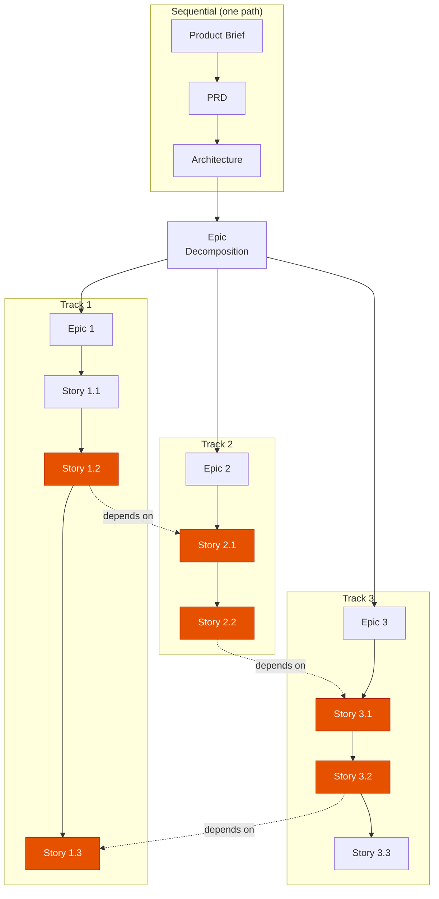

Once you decompose into epics and stories, execution fans out into parallel tracks — and stories on different tracks depend on each other. The stage-gate model doesn't account for:

- **Cross-epic dependency tracking** — Story 2.1 blocks Story 1.2, but nothing in the process models or surfaces this
- **Critical path identification** — Which story chains determine the overall timeline? Nobody knows until something slips.
- **Parallel track coordination** — When Epic 2's stories slip, what happens to Epic 3's dependent stories?
- **Convergence points** — When do the parallel tracks need to come back together, and what validates that they're coherent?

This isn't hypothetical. In the xMP infrastructure project (CCMP), Architecture Decision 8 — the 5-NIC VM model — was finalized *after* Story 2.1 was already complete with a 3-NIC interface mapping. Nobody caught the mismatch for five days, until a cross-track gap analysis surfaced it. Three downstream stories (2.2, 2.5, 3.4) had stale references that would have caused incorrect firewall macros, wrong network assignments, and wrong failover configuration on production VMs [@pursifull_2026a, Theme 1]. The parallel track model worked — but without a synchronization mechanism, the tracks silently diverged.

> **Sample size caveat.** The xMP project is the primary case study for cross-track divergence, gate failures, and drift detection throughout this document. We have used BMAD for multi-developer teaming on only one project over a few rounds, and the observations from that experience — while consistent and specific — are initial findings from a small sample. These conclusions need to be confirmed or refuted through additional projects: the axiathon initiative (25 epics, pre-implementation) and ongoing Pennyfarthing development will provide additional data points. Where xMP findings are used to motivate architectural investments, they should be read as "this happened and is plausible at scale" rather than "this is statistically established."

#### 3b. The human is the integration bus

BMAD is architecturally a solo-practitioner tool augmented by AI agent personas, not a team coordination platform [@pursifull_2026a, Finding #1]. The "team" vocabulary throughout BMAD — Alice the Product Owner, Bob the Scrum Master — refers to AI agents role-playing team members in a single conversation, not mechanisms for human coordination.

Each stage runs in a **fresh conversation** to avoid context pollution. This is a deliberate design choice — but it means the human performs every handoff. The user starts the PRD workflow, completes it, then manually starts the architecture workflow in a new session, carries over the relevant context, and so on.

The human is the step function. They decide when a phase is done, what context carries forward, which agent to invoke next, and whether the output of one stage is ready for consumption by the next. There is no session state, no handoff protocol, no automated transition. For a simple project this is manageable. For anything with multiple epics across multiple sprints, the human becomes the bottleneck *and* the single point of failure for context continuity.

If the user doesn't execute the sequence exactly as intended — and they won't, because reality intervenes — the linear chain fractures. A developer discovers mid-implementation that a requirement was wrong. The user jumps back to update the PRD, then needs to re-run architecture, then return to development — but now some stories were built against the old spec and others against the new one:

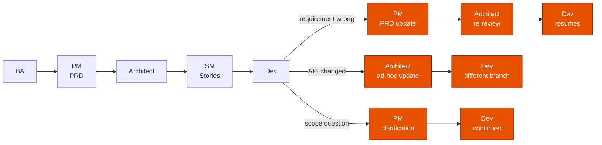

Each of those branches is the user manually creating a new conversation, loading the right context, running the right agent, and threading the results back into the main line. Nothing tracks which branch happened, what changed, or which stories are now stale. The "clean" handoff chain becomes a tangle of ad-hoc jumps — and the only record of the actual execution path is in the user's head.

Pennyfarthing solves this with **phased workflows** — automated agent-to-agent handoffs with session files tracking state across context boundaries. The SM sets up the story, TEA writes failing tests, Dev implements, Reviewer validates, and SM closes — each handoff is automated, with structured context passed through session files, not human memory. Relay mode can run the entire chain unattended.

#### 3c. Every stage uses the same flat workflow mechanism

BMAD has one workflow type: markdown files with YAML frontmatter, where the user advances through steps sequentially. Whether you're writing a product brief, running architecture decisions, executing a sprint, or doing a code review — it's the same mechanism. The user reads the step, does the work, moves to the next step.

But these activities have fundamentally different structures:

| Activity | What it needs | What BMAD provides |
|----------|--------------|-------------------|
| PRD creation | Progressive disclosure, decision gates, user approval at key points | Flat step sequence (happens to work) |
| Architecture | Collaborative exploration with multiple viewpoints (A/P/C menus) | Flat step sequence (added menus help) |
| TDD implementation | Agent handoffs: TEA writes tests, Dev implements, Reviewer checks | Flat step sequence (doesn't fit) |
| Code review | Flexible checklist, agent discretion on what to examine first | Flat step sequence (too rigid) |
| Brainstorming | Non-linear exploration, multiple techniques, no fixed order | Flat step sequence (fights the structure) |

Pennyfarthing's BikeLane engine addresses this by supporting **three distinct workflow types**, each suited to a different kind of work:

| Type | Mechanism | Suited for | Examples |
|------|-----------|-----------|----------|
| **Stepped** | Progressive disclosure, one step at a time, user gates at decision points | Planning and discovery — where human judgment drives progression | PRD, Architecture, Research, Sprint Planning |
| **Phased** | Agent-driven with automated handoffs, session state tracking | Implementation — where multiple agents need to coordinate in sequence | TDD, BDD, Trivial, Agent-Docs |
| **Procedural** | Flexible checklists, agent decides order, no fixed sequence | Reviews and exploration — where structure matters but order doesn't | Code Review, Retrospective, Brainstorming |

BMAD's stepped workflows are equivalent to Pennyfarthing's stepped type — and Pennyfarthing has already ported all nine of BMAD's Phase 1-3 planning workflows into BikeLane (see [BMAD vs Pennyfarthing](../../comparisons/bmad-vs-pennyfarthing.md) and [BMAD Integration](../../../sprint/planning/bmad-integration.md)). But BMAD has no equivalent of phased or procedural workflows, which is why its implementation phase (Phase 4) is the weakest — it's trying to use a planning mechanism for execution.

Beyond workflow types, Pennyfarthing is introducing **declarative gates**: quality checkpoints defined as markdown files with structured pass/fail criteria, attached to workflow transitions. Gates can be evaluated by lightweight subagents (Haiku by default), support nesting and composition, and replace the current pattern where gate logic is buried inside agent handoff code (see [Gate Extraction Epics](../../../sprint/planning/gate-epics.md)). Gates are to workflow transitions what acceptance criteria are to stories — explicit, declarative, and testable.

The initial evidence for gates is compelling, though drawn from a single project. In the xMP project, a 17-finding audit documenting specific process gaps was completed on 2026-01-29. Story 2.2 was implemented the next day — less than 24 hours later — and shipped with seven of the same failures the audit had just identified [@pursifull_2026a, Theme 8]. The audit existed. The remediation plans were written. None of it was in the developer's execution path. Documenting process gaps does not prevent them from recurring; only enforcement embedded in the workflow does [@pursifull_2026a, Finding #5]. A formal checklist evaluated by an AI agent caught and fixed all seven failures on its first use, and process quality across the project improved from 43% to 100% compliance as formal checkpoints were adopted [@pursifull_2026a, Finding #7]. These results are from one project (xMP/CCMP) and need replication across additional projects to confirm the pattern.

### 4. Beyond 1.0, BMAD has no answers

BMAD's lifecycle assumes you're building something new, from scratch, once. The moment the 1.0 ships, the process has nothing to say about what comes next. Real projects don't end at deployment — they evolve, break, get feedback, and face external pressure. BMAD is completely naive about all of it:

- **Bug reports** — No process. Someone finds a bug; how does it enter the lifecycle? Where does it get triaged? How is it prioritized against feature work?
- **New feature requests** — No process. A feature request needs abbreviated discovery (not a full product brief), but BMAD has no mechanism for scoped discovery within an existing product.
- **Dependency changes** — No process. A library goes EOL. A service changes its API. A licensing model shifts. These are external forces that require impact analysis and rapid response.
- **Technical debt** — No process. Debt accumulates during implementation and needs cost/benefit analysis and scheduling alongside feature work. BMAD doesn't acknowledge it exists.
- **User feedback** — No process. Users report that something is confusing or doesn't work the way they expected. That feedback needs triage, validation, and routing to the right lifecycle phase.
- **Product direction changes** — BMAD has "course correction," but it's a single undifferentiated mechanism. A product owner pivoting strategy is a fundamentally different event than a developer discovering an API doesn't work. Both need to influence the process; neither fits through the same door.

The xMP project's PRD validation exposed this directly: BMAD's document format lacks explicit sections to distinguish between operational reality (brownfield you must work with), technical debt (expedient choices to be replaced), delivery scope, platform vision, and future backlog [@pursifull_2026b]. All five categories exist in every post-1.0 project; BMAD's artifacts have no place to put them.

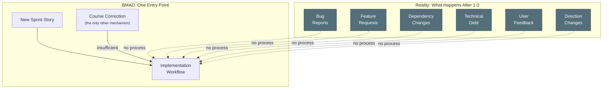

Each of these input types needs different treatment — different urgency, different triage criteria, different lifecycle entry points. BMAD funnels everything through "create a story" or, at best, a vague course correction. That's not a process. That's the absence of one.

### 5. Implementation drift has no upward channel

In the BMAD lifecycle, stories don't get delivered exactly as specified. During implementation, the team discovers that an API doesn't behave as documented, that there are state machines that weren't understood during architecture planning, or that a dependency has unrecognized constraints. The delivered story works — but it's *different* from what the PRD and architecture described.

In BMAD, that drift is invisible. The story closes, the spec stays unchanged, and the gap between "what we said we'd build" and "what we actually built" grows silently.

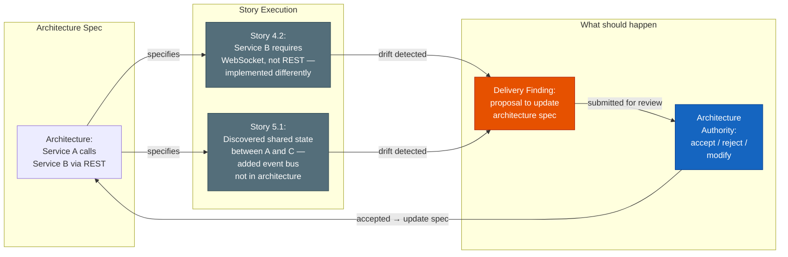

The drift doesn't have to be accepted — but it has to be *known*. Every implementation divergence should flow upward as a structured **Delivery Finding**: what changed, why, and what spec artifacts are now stale. The architecture authority reviews, and either updates the spec to match reality or flags the implementation for correction.

This is the **Finding channel** described in the [Tier Communication Protocol](lifecycle-tier-comm-protocol.md) — an upward async channel from implementation to spec authority. Without it, specs rot on contact with implementation and nobody notices until the next initiative tries to build on assumptions that are no longer true.

In AI-agent systems, drift is uniquely dangerous. In traditional software, a broken reference causes a compile error, a runtime exception, or a 404 — the system stops. In AI-driven systems, a broken reference causes the agent to *improvise*. The output looks plausible, nobody is blocked, and the error propagates silently [@pursifull_2026a, Finding #9]. A forensic analysis of 422 closed BMAD-METHOD issues found 236 bugs; the two categories with zero automated prevention — broken file references and path handling — accounted for 25% of all bugs. A cross-file reference validator replayed across 26 release tags tracked 289 broken references that had accumulated over four months, almost all fixed manually without systematic detection [@pursifull_2026a, Theme 10]. AI projects that coordinate through content references need automated integrity validation the same way traditional software needs compilers and linkers.

### 6. Changes ripple — and nothing tracks the blast radius

When a Delivery Finding *is* accepted and the architecture or PRD changes, the impact doesn't stop at the spec. It ripples outward through every epic and story in the project. Different stories are in different states, and each state requires a different response:

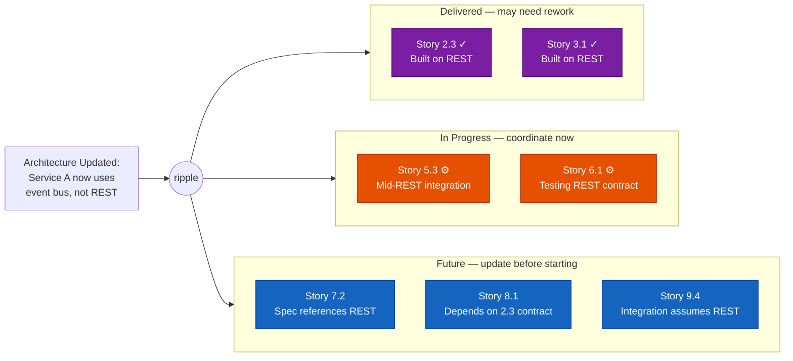

Three blast zones, three different responses — ordered from past to future:

| State | Stories | Response Required |
|-------|---------|-------------------|
| **Delivered** (purple) | Already shipped, built on the old assumption | Assess whether rework is needed. May be fine, may need a patch story. |
| **In progress** (orange) | Actively being worked, mid-implementation | Immediate coordination. The developer needs to know *now* that the ground has shifted. |
| **Future** (blue) | Not yet started, spec references stale assumptions | Update the story spec before work begins. No emergency, but the story can't start as-written. |

In BMAD, none of this tracking exists. A spec change happens and the team relies on someone's memory of which stories are affected. The ripple is invisible until a story fails in review or — worse — in production.

Not all ripples require the same response. The xMP project's PRD validation identified a **propagation taxonomy** for how changes should flow to AI agents [@pursifull_2026b, Finding #4]:

| Classification | Instruction to agents | Example |
|---|---|---|
| **Extend** | Copy this pattern to new code | Task naming conventions, interface patterns |
| **Integrate** | Work with this, don't replicate it | Monolithic configuration structures |
| **Deprecate** | Don't add new dependencies on this | Legacy access patterns being replaced |
| **Target** | New code should follow this going forward | Replacement architecture |

Without this classification, agents treat every existing pattern as something to extend — propagating the old approach into new stories even after the architecture has changed.

### 7. BMAD's process isn't composable

In BMAD, you can't:
- **Attach** a feedback collection overlay to an existing implementation workflow
- **Swap** a regulatory compliance review into the architecture phase
- **Layer** a security assessment on top of the standard code review
- **Inherit** the PRD workflow to create a "Feature Requirements" variant with reduced scope

Each BMAD workflow is standalone. Improvements to the PRD workflow don't automatically benefit a hypothetical "Feature Requirements" workflow because no inheritance mechanism exists.

### 8. Project context doesn't fit — and BMAD has no answer for it

BMAD stores everything in flat files: one `epics.md` for all epics and stories, one `project-context.md` for all project rules, one `sprint-status.yaml` for the entire sprint, one PRD, one architecture document. At session start, the Fresh Chat Protocol loads *all* of this into a single conversation. For a small project, this works. For anything beyond a dozen epics, the files don't fit.

BMAD knows this. The PRD and architecture documents get too large for a single context window, and BMAD offers a chunking strategy — but it's manual, undifferentiated ("split the PRD into sections"), and only addresses those two artifacts. The sprint file, the epic backlog, the story details, the acceptance criteria — those continue to grow as monolithic flat files with no sharding, no selective loading, and no mechanism for loading only what's relevant to the current task. The xMP project already had to constrain story points to 2–3 maximum "for AI context efficiency" — the context window was already the binding constraint on story sizing [@pursifull_2026c].

The problem is structural, not incidental, and it's measurable today. We ran a standardized context window measurement (see `data/context-window-measurement-procedure.md`) across five real projects — three using BMAD and two using Pennyfarthing — loading PM persona + PRD + architecture + all epics + all stories in a clean session. The test deliberately loads *everything* to measure total project footprint, not per-session footprint. The results (see `data/context-window-measurement-results.md`) confirm the scaling argument: **any spec-driven approach that loads project artifacts into context will hit a hard ceiling as the project grows.** This is not a BMAD-specific problem — it's a structural consequence of file-backed context loading. Pennyfarthing's selective loading techniques (discussed below) can defer the wall, but the wall exists for both frameworks and for any framework built on the same architecture. Project context grows somewhere between quadratically and exponentially with scale:

| Growth Driver | Rate | Example |
|---------------|------|---------|
| Stories per epic | Linear | 10 epics × 8 stories = 80 story specs |
| Cross-epic dependencies | Quadratic | Each epic can depend on any other — *n(n-1)/2* potential edges |
| Research artifacts | Accelerating | Each research track produces documents that individually exceed context limits |
| Contributor context multiplication | Multiplicative | Each team member needs the same base context, loaded independently every session |

We're already experiencing this. The research documents informing *this* product brief — single documents written to examine or extend the PRD — are individually too large to load alongside the PRD they reference. The five research tracks produced over 170 sources across documents that range from 15K to 40K tokens each. An agent that needs to cross-reference the PRD, the architecture, and a research synthesis to properly frame a story is already over budget before writing a single line of implementation. The OCSF normalization spike (poller-orchestrator) produced ~370KB of documentation from a single research phase; a hypothesis-driven charter would have kept output tighter, but the artifacts exist and must be accessible to downstream agents [@pursifull_2026d].

#### The context ceiling is lower than the context window

The problem is worse than it appears. Research demonstrates that LLM performance degrades well before the context window is full — but the degree of degradation depends on the model.

**Findings from smaller open-source models** are severe. The effective context length of open-source models with standard position encodings is less than half their training length [@an_etal_2024]. Even with perfect retrieval — relevant information placed directly before the question — accuracy still degrades: Llama-3.1-8B lost 24.2% accuracy on MMLU at 30K tokens despite perfect retrieval, and degradation was measurable within 7K tokens [@hsieh_etal_2024].

**Frontier models degrade less, but are not immune.** When Hsieh et al. [-@hsieh_etal_2024] tested frontier models alongside smaller ones, closed-source models showed significantly more resilience — GPT-4o degraded ~7% on GSM8K where Llama-3.1-8B degraded 48%. However, Claude 3.5 Sonnet showed ~67% degradation on MMLU in the same study, demonstrating that frontier model resilience is task-dependent and non-uniform. The Chroma research group documented "context rot" — predictable decline in output quality as input tokens increase — across 18 models including Claude Opus 4 and Sonnet 4, finding degradation patterns "consistent across model sizes" even as failure modes differ (Claude tends to abstain rather than hallucinate) [@chroma_research_2024].

**The exact threshold for Claude Opus is unknown.** Anthropic reports <5% degradation on retrieval tasks and scores 93% on 8-needle retrieval at 256K tokens for Opus 4.6. But retrieval benchmarks are the easiest long-context task; systematic studies of reasoning-task degradation across context lengths have not been published for Claude. The ~50% threshold from An et al. was demonstrated on open-source models with RoPE embeddings and should not be taken as a universal constant — frontier models likely tolerate more before degradation becomes material. Nevertheless, the direction is unambiguous: performance degrades before the window is full, degradation is measurable even with perfect retrieval, and the gap between retrieval benchmarks and reasoning tasks is large.

The practical implication: **the usable context window is smaller than the raw context window, by a margin that is model-dependent and not yet precisely characterized for frontier models.** The 100K line on the charts below represents a conservative estimate, not a measured threshold for Claude Opus. The true ceiling may be higher — but the structural argument holds regardless of where exactly it falls: projects that consume 97% of raw capacity have no headroom, and projects that consume 55% are in the zone where degradation becomes a factor.

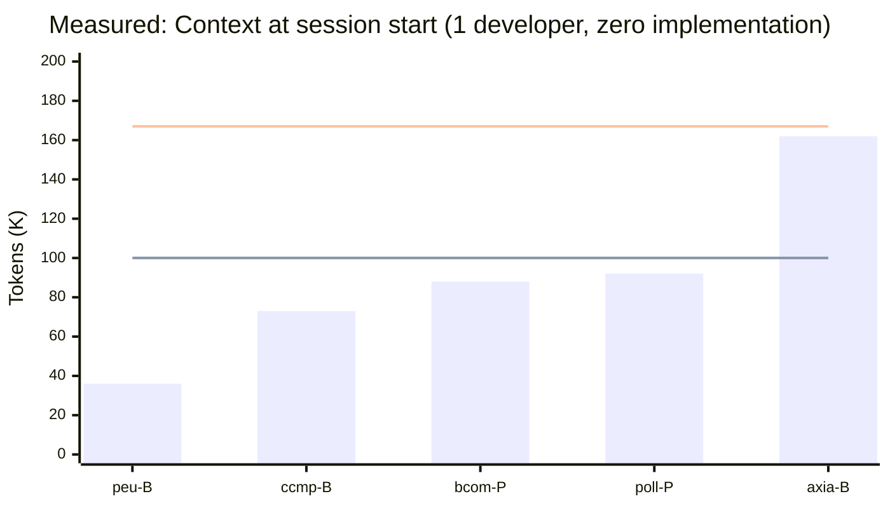

> **Measured data** from five real projects (3 BMAD, 2 Pennyfarthing), each with one developer, zero implementation work. B = BMAD, P = Pennyfarthing. Lower line (100K) = estimated performance ceiling (see caveats below). Upper line (167K) = effective capacity. This test loads all project artifacts to measure total footprint — Pennyfarthing projects show higher context here because the full-load test negates selective loading; at comparable scale (7 epics, ~50 stories), Pennyfarthing's total footprint is actually 15K *higher* than BMAD's due to richer metadata (see `data/context-window-measurement-results.md`). The point is not framework comparison — it's that both frameworks, and any file-backed approach, face the same ceiling. axiathon (25 epics, 268 stories) is at 97% of effective capacity before a single line of code.

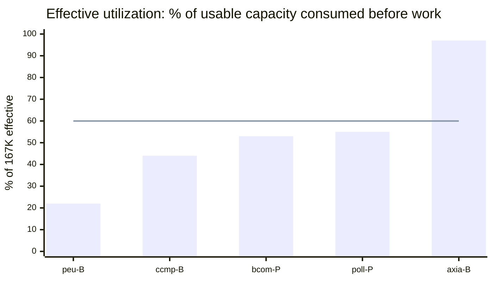

> **Same data as % of usable capacity** (200K window minus 33K reserved buffer = 167K effective). The 60% line marks the estimated performance ceiling (conservative; frontier models may tolerate more — see caveats above). Three of five projects are at or near it. axiathon at 97% means the PM agent has 5K tokens for the entire conversation. See `data/context-window-measurement-results.md` for the full framework comparison.

With a team, the picture accelerates. Each contributor doesn't just add their own work — they add cross-references, coordination context, and the overhead of tracking who is doing what. Sprint planning context alone grows with the number of parallel tracks:

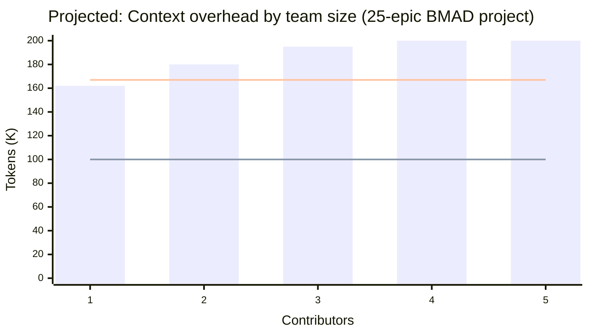

> **PROJECTED — not measured data.** The 1-developer bar (162K) is the measured axiathon value; all other bars are estimates. Additional contributors are projected to add cross-referencing overhead, coordination context, and tracking of who is doing what — but these projections have not been validated empirically. Multi-developer measurements have not yet been taken. The chart illustrates the directional argument (more contributors = more context overhead) but the specific token values for 2+ developers are speculative. At 25 epics with one developer, the project already exceeds effective capacity — that much is measured fact.

Think of it in web performance terms: **time to first contentful paint** measures how long a user waits before seeing anything useful. The equivalent here is **context to first useful turn** — how much of the context window is consumed by project overhead before the agent can do any actual work. In BMAD, that ratio gets worse with every epic added, every research document written, every story completed. There is no mechanism to load selectively, no way to retrieve only what's relevant, and no strategy for keeping the ratio stable as the project grows.

And the growth is not just additive. Over time, as research accumulates, stories complete, and decisions pile up, the total project knowledge base grows even if no new epics are added:

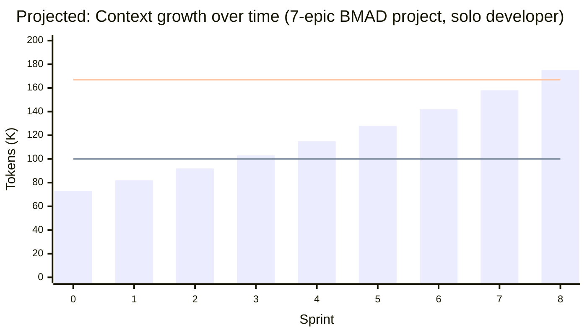

> **PROJECTED — not measured data.** Sprint 0 (73K) is the measured ccmp value: 7 epics, 51 stories, ~1/8 of the way to delivery. The growth rate (~10-15K per sprint) is an estimate based on typical story completion artifacts and has not been measured longitudinally. The directional argument — flat-file loading grows monotonically with project activity — is structural, but the specific per-sprint token values are speculative. This is a 7-epic project — not the 25-epic axiathon, which is already past effective capacity at sprint 0 (measured).

#### The two dimensions

The problem has two dimensions:

1. **Structural** — Flat files grow without bound. There's no sharding (break big files into loadable pieces), no indexing (know what's in a file without loading it), no selective retrieval (load only the stories that matter for this task).

2. **Retrieval** — Even if you shard the files, you need a way to find the *right* shards. As the project grows, the number of potentially relevant artifacts grows faster than any human or agent can enumerate. This is where RAG (retrieval-augmented generation), knowledge graphs, and reranking become necessary — not as nice-to-haves, but as structural requirements for operating at scale.

#### What Pennyfarthing does today

Pennyfarthing addresses the structural dimension:

| Mechanism | What it does | Context saved |
|-----------|-------------|---------------|
| **Sprint sharding** | Index file with epic references; each epic in its own YAML file, loaded on demand | ~5000 → ~100 tokens at startup |
| **Tiered context (Prime)** | Four loading tiers — FULL on first turn, MINIMAL by turn 3+ [@pursifull_2026s] | ~4000 → ~200 tokens after turn 3 |
| **Session extraction** | Load header + last assessment only, not full history (ADR-0009) | ~2000 → ~500 tokens per session |
| **Sprint summary injection** | Two-line progress string instead of full sprint data | ~5000 → ~50 tokens |
| **Epic context files** | Per-epic deep-dive context, loaded only when working on that epic | ~0 tokens until explicitly needed |
| **Sidecar pruning** | Line limits (40–50 lines) with health-check enforcement | Bounded growth, forced consolidation |
| **Shard validation** | Write-time integrity checks prevent broken references [@pursifull_2026t] | Prevents silent loading failures |

These mechanisms keep the context-to-work ratio manageable for projects up to about 20–30 epics with one or two contributors. Measured data confirms that Pennyfarthing's sharding benefit appears in routine use (selective loading), not in total project footprint — see the apples-to-apples comparison in `data/context-window-measurement-results.md`. But they're all *structural* solutions — manual sharding decisions, hand-tuned tier thresholds, explicit load paths. None of them address the retrieval problem: given 200 context files, 50 completed stories, and 30 research documents, which 5 are relevant to the story I'm about to implement?

#### What's needed next

That's the next frontier. A project at production scale — or a team of any size working on a product with real depth — needs:

- **Indexed retrieval** — semantic search over project artifacts, so an agent starting a story can pull the 3 most relevant research documents, the 2 most relevant completed stories, and the specific architecture section that applies
- **Relationship-aware context** — a knowledge graph connecting stories to epics to architecture decisions to research findings, so the agent can traverse dependencies rather than loading everything to find connections
- **Relevance ranking** — reranking retrieved context by relevance to the current task, so the limited context window is filled with the highest-value information first
- **Context budget monitoring** — instrumentation that tracks how much of the effective window (not just the raw window) is consumed by overhead vs. available for work, per agent, per turn

Without these, every additional epic and every additional team member accelerates the point at which the context budget becomes the binding constraint — not the agent's capability, not the quality of the specs, but the sheer volume of project knowledge that can't be efficiently accessed.

### A note on scope

BMAD has problems beyond the eight listed here. Some — like the single flat workflow type (3c), the absence of automated handoffs (3b), and the lack of programmatic validation — Pennyfarthing has already solved. Others, like the organizational model assumptions and the gap between planning artifacts and execution reality, are still being explored (see [BMAD vs Pennyfarthing](../../comparisons/bmad-vs-pennyfarthing.md); [Gap Analysis](../../comparisons/bmad-pennyfarthing-gap-analysis.md)). A cross-project analysis of BMAD-generated architecture artifacts found five categories of failure where the planning outputs diverged from industry consensus, requiring human-led research to validate and correct [@pursifull_2026f].

This document is about the **lifecycle problem** specifically — not a catalog of everything wrong with spec-driven development as practiced by BMAD. BMAD was the incubator. It introduced the core ideas — agent personas, stepped workflows, structured planning artifacts — and we continue to lift innovations from it. BMAD's contributions are substantial: without its demonstration that AI agents could follow structured processes to produce real planning artifacts, the entire approach documented here would not exist. But Brian Madison's orientation as a PMP-style process thinker constrains what BMAD can become. The framework optimizes for upfront planning discipline at the expense of execution feedback, runtime adaptation, and operational composability. Those are the gaps this proposal addresses.

---

## The Vision: What We Want

> **Early draft.** Everything below this line is initial thinking — directionally correct but not yet validated through discovery or team review. Expect significant revision.

| Section | |
|---------|---|
| **A. Complete Lifecycle Loop** | Pipeline → loop with LEARN phase |
| **B. Multiple Input Channels** | Triage six input types to the right entry point |
| **C. Fractal Lifecycle (Scale-Invariant)** | Same pattern at product, feature, and spike scale |
| **D. Research Spike as First-Class Lifecycle** | Structured exploration with fold-back |
| **E. Composable Process Architecture** | Variants, overlays, and chains |
| **F. Context-Aware Project Intelligence** | Indexed retrieval, knowledge graphs, context budget management |
| **Why This Matters for Spec-Driven AI** | Operational scaling with AI agents |
| **What We're Proposing to Build** | Five phased implementation tracks |
| **Success Metrics** | Measurable targets per capability |
| **What We're NOT Doing** | Scope boundaries |
| **Risks and Open Questions** | Mitigations and open decisions |
| **Industry Precedent** | Frameworks informing the design |
| **Next Steps** | Actions to move from brief to PRD |

### A. The Complete Lifecycle Loop

> **Warning — this diagram is illustrative, not literal.** The loop shown below is based on BMAD's stage-gate model extended with a LEARN phase. It is not what Pennyfarthing will actually implement. We are not building a DEPLOY → LEARN cycle for one-shot passion-project SaaS applications. "Deploy" in our context means *integrate with the team's efforts* — merge, validate against the broader system, confirm coherence with parallel work. The real process is fractal (section C below): product-level, feature-level, and spike-level lifecycles are miniature reflections of the same pattern, each operating at different depth and speed. A feature lifecycle doesn't deploy and monitor — it integrates and validates against the parent architecture. The diagram below is presented in this simplified form so the reader has a common frame of reference for *what we're changing* before we get into *how it actually works*. It needs correction, and we ask for your indulgence while we use it as a starting point.

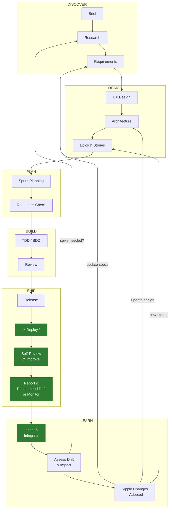

The lifecycle becomes a **loop**, not a pipeline. The LEARN phase feeds findings back to the appropriate upstream phase. An AI agent can trace the impact of a change from updated requirements through architecture, affected epics, and downstream stories — and flag what's stale.

### B. Multiple Input Channels

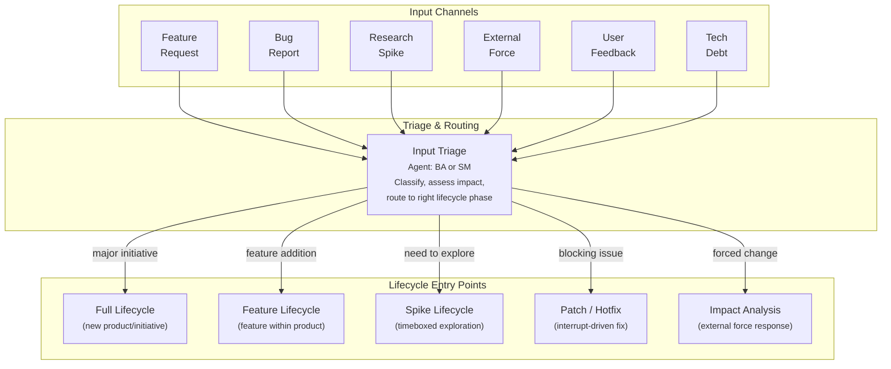

Each input type routes to the appropriate lifecycle scope. The triage step is itself a lightweight workflow — an AI agent classifying the input, assessing impact, and recommending routing.

### C. Fractal Lifecycle (Scale-Invariant)

The same lifecycle pattern repeats at different scales. Each level inherits the structure and validators from the parent but operates at reduced scope and speed. Three scales illustrate the pattern:

| Scale | Scope | Inherits from | Produces |
|-------|-------|---------------|----------|
| **Product** | New product or major initiative | Nothing — establishes the baseline | PRD, Architecture, Epics |
| **Feature** | Feature within an existing product | Product PRD + Architecture | Requirements delta, Architecture delta, Stories |
| **Bug** | Defect in shipped work | Feature/Product context + failing behavior | Root cause, Fix, Regression test |

#### Product Scale

The full lifecycle. Establishes the baseline artifacts that all smaller scales inherit.

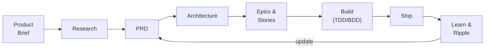

#### Feature Scale

A miniature reflection of the product lifecycle. The product brief and PRD already exist — the feature inherits that context and produces deltas.

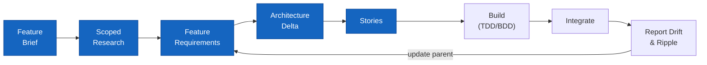

#### Bug Scale

The lightest lifecycle. No brief, no architecture phase — the product context and failing behavior are the inputs. The output is a root cause, a fix, and a regression test. If the fix reveals architectural drift, it ripples upward.

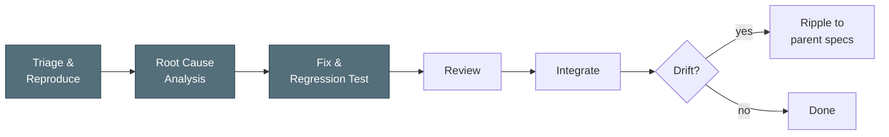

**Key principle:** A feature lifecycle is not a copy of the product lifecycle — it's a **variant** that inherits the product context (existing PRD, existing architecture) and produces deltas. A bug lifecycle is even lighter — it inherits everything and only produces a fix plus a drift signal. When any scale's output diverges from the parent's specs, the ripple mechanism updates upstream. The lifecycle is the same pattern at every scale; only the depth and ceremony change.

### D. Research Spike as First-Class Lifecycle

A spike is not an ad-hoc exploration. It's a structured mini-lifecycle with specific deliverables:

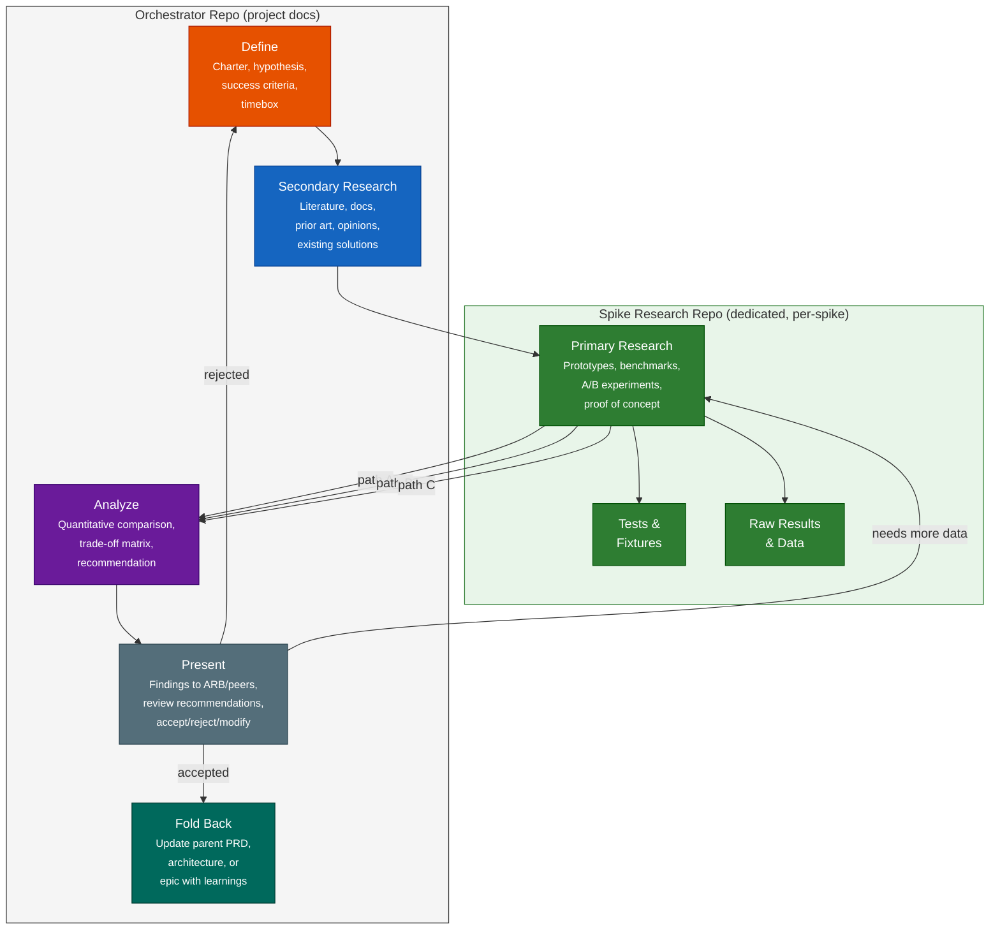

This model has already been validated. The OCSF normalization spike [@pursifull_2026d; @pursifull_2026e] followed this lifecycle retroactively, producing a charter, structured findings, a review record, and a fold-back document. The spike produced ~370KB of documentation; a charter written upfront would have kept output tighter by constraining scope to hypothesis-driven exploration. Key lesson: "Keep spike outputs as findings, not feature-lifecycle artifacts — the spike feeds the feature lifecycle, it doesn't replace it" [@pursifull_2026d].

**Lesson from context window measurement:** The OCSF spike stored all artifacts — code, tests, raw results, and documentation — in the poller-orchestrator repo. When measuring context at session start, poller consumed 92K tokens (55% of effective capacity) with only 1 epic and 20 stories, higher than ccmp (73K) with 7 epics and 51 stories. The inflated footprint comes from research artifacts living alongside project docs. Research code, test fixtures, and raw results pollute the orchestrator's context budget and CI pipeline. Spike repos solve this.

#### Spike repo separation

Spikes produce two categories of output that belong in different places:

| Category | Belongs in | Examples | Rationale |
|----------|-----------|----------|-----------|
| **Project docs** | Orchestrator repo | Charter, findings document, fold-back amendment, ADR | Part of the project's decision record; loaded by PM/Architect agents |
| **Research artifacts** | Dedicated spike repo | Prototype code, test suites, benchmarks, raw data, experiment logs | Has its own CI; doesn't pollute project context budget; can be archived independently |

Each spike gets a dedicated git repo (e.g., `spike-context-retrieval`, `spike-ocsf-normalization`). The orchestrator's sprint planning references the spike repo but doesn't contain it. This keeps the orchestrator's context budget clean — the PM agent loading project state never sees prototype code or benchmark data unless it explicitly reaches into the spike repo.

**Spike properties in an AI-agent context:**
- **Bootstrappable from parent project** — AI agent reads parent PRD/architecture, creates spike context automatically
- **Parallel path exploration** — AI agents can execute multiple prototype paths concurrently (A/B/C)
- **Structured deliverables** — Not just "we tried stuff." A spike produces: hypothesis tested, methods used, data collected, quantitative comparison, recommendation with rationale
- **Fold-back mechanism** — Standard format that updates parent project artifacts (PRD amendment, ADR, architecture delta)
- **Repo-separated** — Project docs (charter, findings, fold-back) in the orchestrator; prototype code, tests, and raw results in a dedicated spike repo. Keeps the orchestrator's context budget clean and gives research artifacts their own CI
- **Re-runnable with variations** — Change the hypothesis or constraints, re-run with fresh agents. The spike template is parameterized, not one-off.
- **Peer-reviewed before accepted** — Findings go to an ARB-equivalent review (could be the Reviewer agent + Architect agent in tandem) before recommendations are folded back

### E. Composable Process Architecture

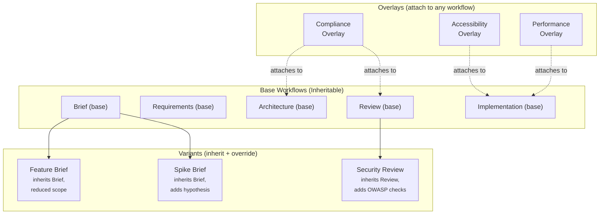

**Three composition mechanisms:**

| Mechanism | What it does | Example |
|-----------|-------------|---------|
| **Variant** | Inherits a base workflow, overrides scope/speed/depth. Improvements to base are inherited. | Feature Brief inherits Product Brief, reduces depth |
| **Overlay** | Attaches additional steps/checks to any workflow. Non-destructive. | Compliance overlay adds regulatory checks to Architecture |
| **Chain** | Sequences workflows. Output of one becomes input of next. | Spike → Feature Lifecycle → Implementation |

### F. Context-Aware Project Intelligence

Section 8 documents the problem: flat-file context collapses under its own weight as projects grow, and performance degrades well before the raw context window is full (the exact threshold is model-dependent — see section 8 caveats). Pennyfarthing's structural sharding (Prime, sprint shards, session extraction) buys time but doesn't solve retrieval. The vision below is a *direction*, not a specification — a layered context intelligence system that would need to be validated through research spikes before commitment:

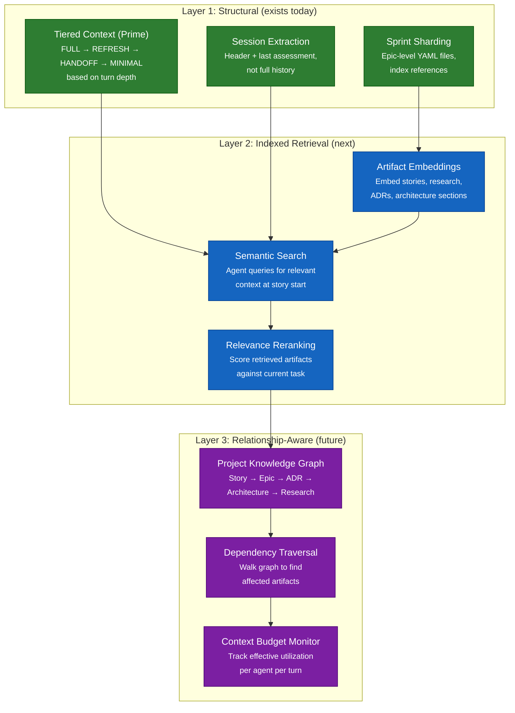

**Layer 1 (structural — exists)** keeps the context-to-work ratio manageable for small projects. **Layer 2 (indexed retrieval)** lets agents find the right context without loading everything — the difference between "load all 200 artifacts" and "retrieve the 5 that matter." **Layer 3 (relationship-aware)** enables the ripple analysis from section 6 and the drift detection from section 5 to operate over the full project graph, not just the artifacts that happen to be loaded.

The goal metric is **context to first useful turn**: the percentage of the effective context window consumed by project overhead before the agent begins productive work. Today with Pennyfarthing's structural sharding, this is ~15–25% for small projects. The target is to hold it below 20% regardless of project scale — which requires retrieval, not just sharding.

---

## Why This Matters for Spec-Driven AI Development

This isn't about making humans follow more checklists. This is about **AI agents operating at multiple scopes with the same spec-driven patterns.**

| Traditional Process | Spec-Driven AI Execution |
|---|---|
| Human reads PRD, interprets requirements | AI agent reads PRD spec, generates requirements programmatically |
| Human notices architectural drift in code review | AI agent traces spec→implementation divergence automatically |
| Human runs a spike by writing throwaway code | AI agent executes multiple prototype paths in parallel, benchmarks them |
| Human propagates requirement change by updating docs | AI agent traces impact from changed spec through all downstream artifacts |
| Human triages bug report and creates story | AI agent classifies input, assesses impact, routes to correct lifecycle scope |

The fractal lifecycle isn't organizational scaling (SAFe's "teams of teams"). It's **operational scaling** — the same AI agent chain (PM→Architect→TEA→Dev→Reviewer) executing at product scope, feature scope, or spike scope, driven by the same spec patterns but parameterized for different depth and speed.

**The specs are the product.** When an AI agent can read a product-level PRD and generate a feature-level requirements variant automatically, the lifecycle becomes genuinely fractal. When an AI agent can detect that implementation diverged from architecture and generate a drift report, the feedback loop closes itself. When an AI agent can bootstrap a spike from the parent project's context and fold findings back as a structured amendment, exploration becomes repeatable.

---

## What We're Proposing to Build

> **Early draft — contingent on vision validation.** The phase plan below follows from the vision sections above, which are themselves initial thinking. Phase 1 is concrete enough to begin; Phases 2–5 are directional and should be re-evaluated as Phase 1 learnings accumulate. Treat this as "here's a plausible path" rather than "here's the plan."

### Phase 1: Close the Loop

| New Workflow | Type | Agent | Purpose |
|---|---|---|---|
| **integration-validation** | Stepped | TEA + DevOps | Post-release: verify features work together, run integration tests |
| **drift-assessment** | Stepped | Architect | Compare implementation against architecture spec, flag divergence |
| **feedback-collection** | Stepped | BA | Gather and structure user/stakeholder feedback into actionable findings |
| **change-propagation** | Stepped | Architect + SM | Trace impact of spec change through all downstream artifacts |

### Phase 2: Multiple Input Channels

| New Workflow | Type | Agent | Purpose |
|---|---|---|---|
| **input-triage** | Stepped | BA or SM | Classify incoming work (feature/bug/spike/external/debt), route to correct lifecycle |
| **impact-analysis** | Stepped | Architect + BA | Assess impact of external force (dependency EOL, CVE, licensing change) |
| **debt-assessment** | Stepped | Architect + Dev | Quantify technical debt, produce cost/benefit analysis for scheduling |

### Phase 3: Fractal Lifecycle

| New Workflow | Type | Agent | Purpose |
|---|---|---|---|
| **feature-brief** | Stepped (variant of product-brief) | PM/BA | Abbreviated discovery scoped to feature within existing product |
| **feature-requirements** | Stepped (variant of prd) | PM | Feature-scoped requirements inheriting product PRD context |
| **feature-architecture** | Stepped (variant of architecture) | Architect | Architecture delta from product architecture |
| **spike** | Stepped | Architect + Dev | Structured exploration with parallel paths and fold-back |

### Phase 4: Composability

| Capability | Type | Purpose |
|---|---|---|
| **Workflow inheritance** | Engine enhancement | Variants inherit base workflow steps, override what's different |
| **Overlay attachment** | Engine enhancement | Attach additional steps/checks to any workflow non-destructively |
| **Chain composition** | Engine enhancement | Sequence workflows, output→input piping |
| **Scope parameterization** | Engine enhancement | Same workflow at product/feature/component/spike scale |

### Phase 5: Context Intelligence (Research Direction)

> **This phase is a research problem, not an engineering task.** Phases 1–4 are workflow engineering with known implementation patterns. Phase 5 requires building a custom retrieval system — embedding pipelines, vector stores, knowledge graphs, reranking models — that is a different class of problem requiring different skills and infrastructure. We include it here because the context scaling problem (section 8) demands an answer, and these are plausible directions for that answer. But they are hypotheses to be tested through spikes, not features to be scheduled. If the problems documented in section 8 are what "wrong" looks like, the capabilities below illustrate what "right" *might* look like.

| Capability | Type | Purpose |
|---|---|---|
| **Artifact embedding pipeline** | Infrastructure (research) | Embed stories, research, ADRs, architecture sections into vector store on write |
| **Semantic context retrieval** | Engine enhancement (research) | Agent queries for relevant context at story start; retrieve top-*k* artifacts by relevance |
| **Project knowledge graph** | Infrastructure (research) | Story → Epic → ADR → Architecture → Research relationship graph; enables dependency traversal |
| **Context budget monitor** | Instrumentation | Track effective context utilization per agent per turn; alert when overhead exceeds threshold |
| **Relevance reranking** | Engine enhancement (research) | Score retrieved artifacts against current task; fill context window with highest-value information first |

---

## Success Metrics

| Metric | Current State | Target |
|---|---|---|
| Post-ship lifecycle coverage | 0 workflows | 4 workflows (validate, drift, feedback, propagate) |
| Input channel coverage | 1 (new story) | 6 (feature, bug, spike, external, feedback, debt) |
| Lifecycle scales supported | 1 (product) | 4 (product, feature, spike, component) |
| Spec-to-implementation drift detection | Manual/ad-hoc | Automated per-release |
| Spike fold-back to parent project | Informal | Structured with standard deliverables |
| Requirement change impact tracing | None | Automated downstream artifact flagging |
| Process quality (gate compliance) | 43% without gates (xMP, single project — [@pursifull_2026a]) | 100% with declarative gate enforcement (needs replication) |
| Context to first useful turn | ~30% overhead (15 epics, sharded) | <20% regardless of project scale |
| Effective context utilization | No monitoring | Instrumented per-agent, per-turn tracking |

---

## What We're Explicitly NOT Doing

- **Not building a project management tool** — BikeLane orchestrates AI agents, not human task boards
- **Not replacing Jira** — Jira remains the external tracking system; BikeLane is the execution engine
- **Not making the process heavier** — Variants and overlays should reduce ceremony for smaller scopes, not add it
- **Not requiring all phases for all work** — The triage step routes to the *minimum viable lifecycle* for each input type
- **Not changing existing working workflows** — TDD, BDD, Trivial, Release are stable. We're extending, not replacing.

---

## Scope of This Proposal

This document aims to establish two things:

1. **That the problems are real and structural.** The eight issues in the "What's Actually Broken" section are documented with specific examples and, where possible, measured data. They are not exhaustive, but they are concrete.

2. **That solutions are plausible.** The vision sections and build plan illustrate directions that *could* address these problems. They are not proven solutions — they are hypotheses that need development, prototyping, and validation.

This document does not attempt a competitive analysis of alternative frameworks or approaches. Other tools in the AI-assisted development space (Cursor's context management, Windsurf's cascade, Aider's repo mapping, and others) may address some of these problems differently. A thorough competitive analysis should be part of the discovery phase before committing to a build plan. What we can say is that the problems identified here — incomplete lifecycle, missing feedback loops, context scaling limits — are structural to the spec-driven-AI pattern, not specific to any one tool.

---

## Risks and Open Questions

| Risk | Mitigation |
|---|---|
| Over-engineering: composability adds complexity to BikeLane engine | Start with variants (YAML inheritance) before overlays (runtime attachment) |
| Scope creep: "complete lifecycle" could mean anything | Phase the work. Close the loop first (Phase 1), then add inputs, then fractal, then composability |
| AI agent context limits: fractal context (product + feature + spike) may exceed windows | BikeLane already manages context budgets per agent; fractal scoping needs the same discipline. Structural sharding (section 8) buys time; indexed retrieval is the long-term answer |
| Change propagation could be noisy | Drift assessment should classify changes as intentional (accepted drift) vs accidental (needs correction) |

| Open Question | Who Decides |
|---|---|
| Should spike findings require human approval before fold-back, or can AI agents auto-merge? | PM + Architect |
| What's the minimum viable "feature lifecycle" — how many steps can we skip? | BA discovery needed |
| Should overlays be defined in YAML or as separate workflow files? | Architect |
| How do we handle conflicting feedback from multiple input channels? | PM prioritization (WSJF or similar) |

---

## Industry Precedent

This proposal draws on established frameworks:

| Concept | Framework | How We Use It |
|---|---|---|
| Fractal process repetition | SAFe (Agile Release Train as fractal of Team) | Same lifecycle at product/feature/spike scale |
| Architectural fitness functions | "Building Evolutionary Architectures" (Ford/Parsons) | Automated drift detection against architecture spec |
| Timeboxed research spikes | XP (Extreme Programming), SAFe Spikes | Structured spike lifecycle with fold-back |
| Progressive Spike-Driven Development | PSDD (Ordisoftware) | Structured alternation of exploration, validation, refinement |
| Change impact analysis | Regulatory Lifecycle Management | Trace requirement changes through downstream artifacts |
| Continuous feedback loops | DevOps feedback taxonomy | Multiple feedback types feeding back to appropriate lifecycle phase |
| WSJF prioritization | SAFe | Triage and prioritize inputs from multiple channels |
| Process inheritance | Object-oriented design patterns | Workflow variants inherit from base, override as needed |
| Context rot / degradation | [@chroma_research_2024; @hsieh_etal_2024] | Context budget management; performance degrades before window is full (threshold model-dependent) |
| RAG for project knowledge | [@lewis_etal_2020; @guu_etal_2020] | Indexed retrieval over project artifacts for selective context loading |
| Knowledge graphs for traceability | Neo4j / property graph patterns | Relationship-aware context; dependency traversal for ripple analysis |

---

## Next Steps

1. **Review this brief with the team** — Keith, Mike R, Musthaq
2. **Discovery on spike lifecycle** — BA deep-dive on what "good spike deliverables" look like for our AI-driven context
3. **Prototype workflow inheritance in BikeLane** — Can we make a YAML variant that extends a base workflow?
4. **Map the "LEARN" phase agents** — Which existing agents (BA, Architect, SM) own which feedback loop steps?
5. **Context budget instrumentation** — Instrument Prime to measure effective context utilization per agent, per turn. Establish baseline for context-to-first-useful-turn metric
6. **Spike: retrieval architecture** — Evaluate embedding + vector store options (local vs. hosted) for project artifact retrieval. Timebox to 1 sprint. Produce findings for fold-back (following the spike lifecycle model validated in @pursifull_2026d)
7. **Write the full PRD** — After brief is accepted, use the `prd` stepped workflow to formalize requirements

---

## References

::: {#refs}
:::
