# Pennyfarthing Workflow Visual Maps

## Terminology

**BikeLane** is the workflow engine. It orchestrates three types of workflows:

| Type | Description | Examples |
|------|-------------|----------|
| **Stepped** | Progressive disclosure with user gates. Human-paced, planning-oriented. | PRD, Architecture, Epics & Stories, Release |
| **Phased** | Agent-driven with automatic handoffs. Machine-paced, implementation-oriented. | TDD, BDD, Trivial, Patch |
| **Procedural** | Flexible checklists, no fixed sequence. Agent discretion on order. | Brainstorming, Code Review, Retrospective |

The full product lifecycle is not a single named workflow — it is a **chain of BikeLane workflows** that progresses from discovery through implementation to release. Each link in the chain is a standalone workflow that produces artifacts consumed by the next.

---

## 1. Full Product Lifecycle (Macro View)

This is the end-to-end chain. Each box is a separate BikeLane workflow. Stepped workflows are human-gated; phased workflows are agent-driven.

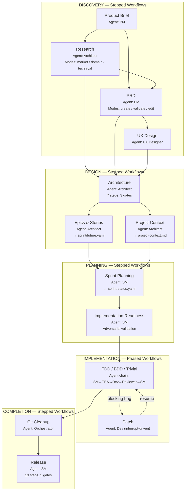

---

## 2. Discovery Phase Detail

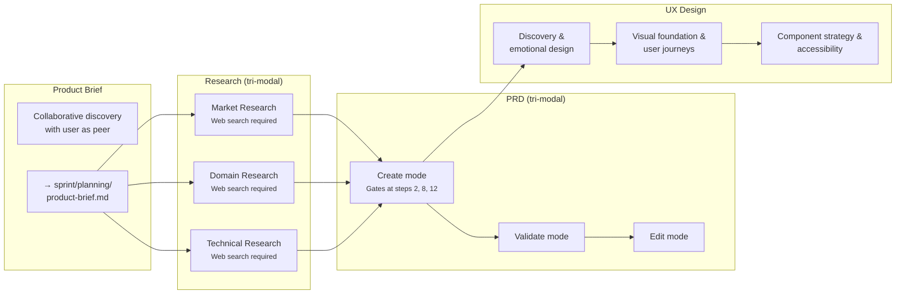

---

## 3. Implementation Phased Workflows

### 3a. TDD (Default)

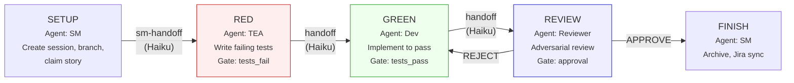

**Triggers:** `feature`, `enhancement`, 3+ story points, or `default: true`

### 3b. BDD

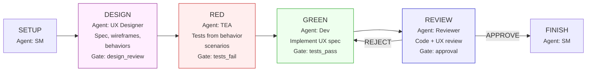

**Triggers:** `ui`, `ux`, `behavior`, `component` types; `bdd`, `ux-first` tags; 2+ points

### 3c. Trivial

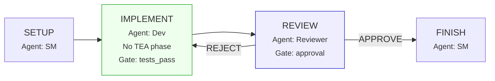

**Triggers:** `chore`, `fix`, `refactor` types; max 2 story points

### 3d. TDD-Tandem

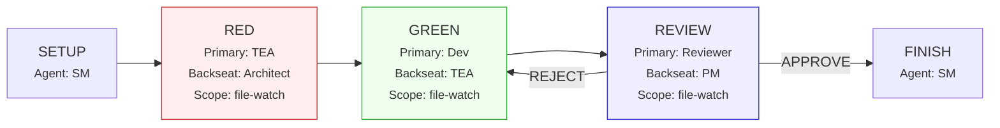

**Tandem mechanism:** Backseat agent (Haiku, background) watches primary via `git diff` / file reads. Observations injected automatically through PostToolUse hook and bell-mode.

### 3e. BDD-Tandem

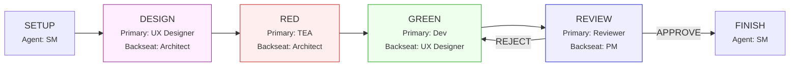

### 3f. 2Party-TDD (Story Refinement + TDD)

The most complex workflow. Pre-implementation brainstorming ensures story clarity before any code is written.

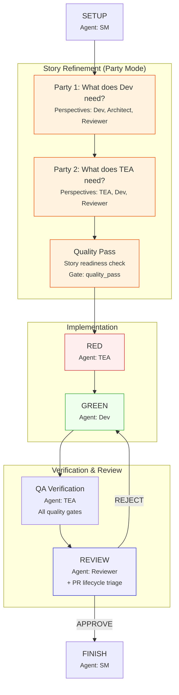

### 3g. Agent-Docs

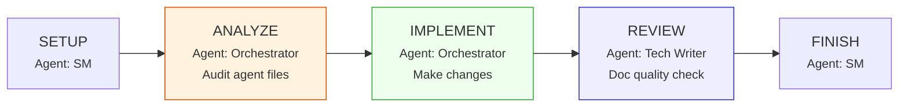

**Triggers:** `docs`, `refactor`, `infrastructure` types; `agent-file`, `process-improvement` labels

### 3h. Patch (Interrupt-Driven)

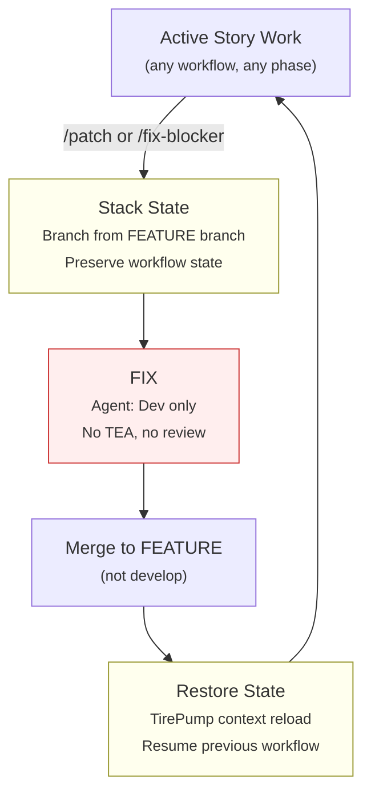

---

## 4. Release Stepped Workflow

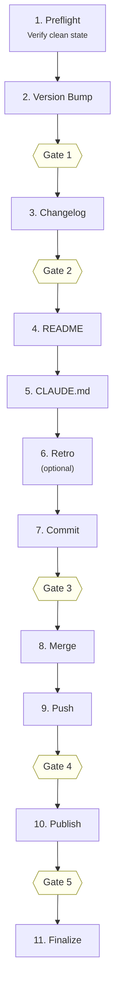

Each gate pauses for user confirmation. Every destructive/irreversible step is gated.

---

## 5. Agent Hierarchy

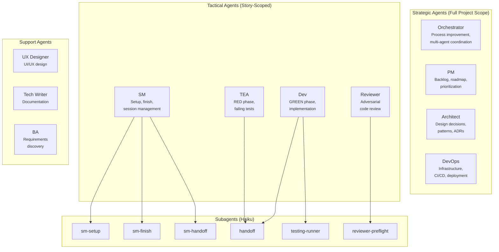

---

## 6. Handoff Protocol

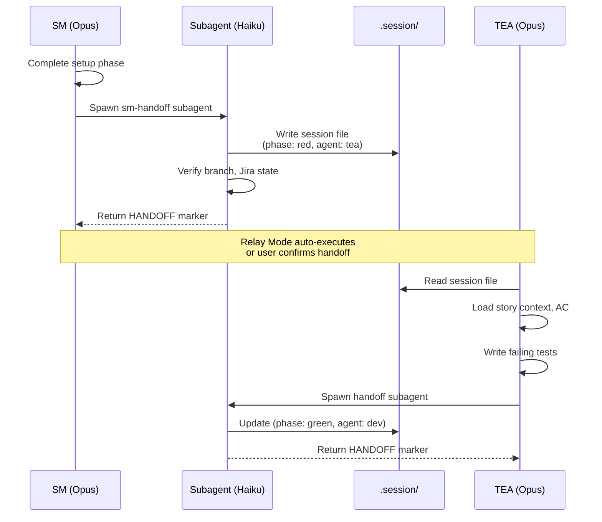

---

## 7. Tandem Protocol

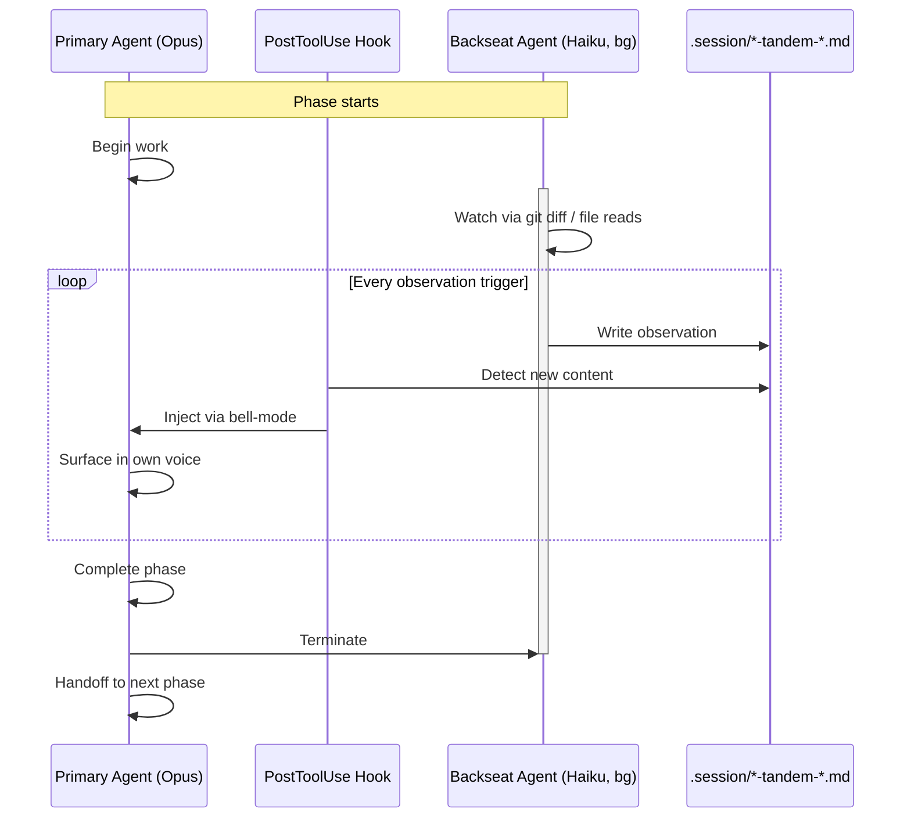

---

## 8. Workflow Selection Logic

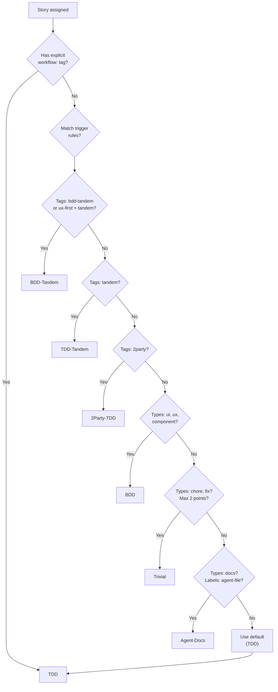

---

## 9. Complete Workflow Inventory

### Phased (8 workflows)

| Workflow | Flow | Trigger |
|----------|------|---------|
| **tdd** | SM → TEA → Dev → Reviewer → SM | Default; feature/enhancement, 3+ pts |
| **bdd** | SM → UX → TEA → Dev → Reviewer → SM | ui/ux/component types; bdd tag |
| **trivial** | SM → Dev → Reviewer → SM | chore/fix/refactor, max 2 pts |
| **tdd-tandem** | SM → TEA+Architect → Dev+TEA → Reviewer+PM → SM | tandem tag, 3+ pts |
| **bdd-tandem** | SM → UX+Architect → TEA → Dev+UX → Reviewer+PM → SM | bdd-tandem tag |
| **2party-tdd** | SM → Party(Dev) → Party(TEA) → QC → TEA → Dev → QA → Reviewer → SM | 2party tag |
| **agent-docs** | SM → Orchestrator → Orchestrator → Tech Writer → SM | docs type; agent-file label |
| **patch** | Dev only (interrupt, stack-based) | /patch or /fix-blocker command |

### Stepped (11 workflows)

| Workflow | Agent | Purpose | Output |
|----------|-------|---------|--------|
| **product-brief** | PM | Product discovery | product-brief.md |
| **research** | Architect | Market/domain/tech research | research.md |
| **prd** | PM | Requirements (create/validate/edit) | prd.md |
| **ux-design** | UX Designer | Visual design, accessibility | ux-design-specification.md |
| **architecture** | Architect | Technical design, 7 steps | architecture doc |
| **epics-and-stories** | Architect | PRD → epic/story breakdown | sprint/future.yaml |
| **project-context** | Architect | AI agent context rules | project-context.md |
| **sprint-planning** | SM | Sprint status generation | sprint-status.yaml |
| **implementation-readiness** | SM | Pre-implementation validation | readiness-report.md |
| **git-cleanup** | Orchestrator | Organize uncommitted changes | Clean commits |
| **release** | SM | Version, changelog, publish | Published package |

### Procedural (3+ workflows)

| Workflow | Agent | Purpose |
|----------|-------|---------|
| **brainstorming** | Any | 62 techniques, structured problem-solving |
| **code-review** | Reviewer | Review checklists |
| **retrospective** | SM | Sprint retrospective |
