# Product Brief: Composable Lifecycle Engine

**Author:** Michael Pursifull (BA discovery by Avasarala)
**Date:** 2026-02-14
**Status:** Draft — For Team Review
**Context:** Spec-driven development with AI agent execution (Pennyfarthing/BikeLane)

---

## The Problem in One Sentence

The BMAD product lifecycle is a one-way street with one front door: it starts at "product brief," ends at "story shipped," has no feedback loops, no way to handle external change, no mechanism for exploration, and no way to run the same process at different scales.

> **Note:** There are additional structural problems — the human-as-integration-bus handoff model, the single flat workflow type, the absence of quality gates — some of which are explored in companion documents. The need for a Composable Lifecycle Engine follows directly from the sentence above: every clause is a gap that must be closed.

---

## Document Map

| Section | |
|---------|---|
| **What's Actually Broken (1–7)** | Seven structural problems with BMAD's lifecycle model |
| **The Vision (A–E)** | Five design goals for what replaces it *(early draft)* |
| **Why This Matters / Proposal / Metrics** | Spec-driven AI argument, phased build plan, success criteria |
| **Risks, Precedent, Next Steps** | Open questions, industry grounding, immediate actions |

**Companion documents:**

| Document | Purpose |
|----------|---------|
| [Lifecycle Composition Index](lifecycle-composition-index.md) | Initiative tracker — all documents, research tracks, and progress |
| [BMAD vs Pennyfarthing](bmad-vs-pennyfarthing.md) | Feature-by-feature comparison, "left vs right" framework |
| [Gap Analysis](bmad-pennyfarthing-gap-analysis.md) | Agent, workflow, and infrastructure gaps between BMAD and Pennyfarthing |
| [BMAD Integration](../sprint/planning/bmad-integration.md) | How BMAD and Pennyfarthing work together today |
| [Gate Extraction Epics](../sprint/planning/gate-epics.md) | Declarative gate system — epic and story breakdown |
| [Tier Communication Protocol](lifecycle-tier-comm-protocol.md) | Channel taxonomy for inter-tier communication (Finding, Intent, Alert, etc.) |
| [Tier Definitions](lifecycle-tier-definitions.md) | Formal tier definitions with VSM S1–S5 mapping |
| [Research Synthesis](lifecycle-research-synthesis.md) | Unified synthesis across five research tracks (171 sources) |

---

## What's Actually Broken

### 1. The lifecycle is incomplete — it stops at "shipped"

```mermaid
graph LR
    subgraph "What BMAD covers today"
        PB["Product<br/>Brief"] --> PRD["PRD"] --> ARCH["Architecture"]
        ARCH --> ES["Epics &<br/>Stories"] --> SP["Sprint<br/>Planning"] --> IMPL["TDD/BDD<br/>Implementation"]
        IMPL --> REL["Release"]
    end

    subgraph "What happens next (not covered)"
        INT["Integration<br/>Validation"]
        DRIFT["Architectural<br/>Drift Detection"]
        FB["User<br/>Feedback"]
        LEARN["Learning<br/>Capture"]
        PROP["Change<br/>Propagation"]
    end

    REL -.->|"???"| INT
    INT -.->|"???"| DRIFT
    DRIFT -.->|"???"| FB
    FB -.->|"???"| LEARN
    LEARN -.->|"???"| PROP
    PROP -.->|"should feed back"| PRD

    style INT fill:#546e7a,stroke:#29434e,color:#fff
    style DRIFT fill:#546e7a,stroke:#29434e,color:#fff
    style FB fill:#546e7a,stroke:#29434e,color:#fff
    style LEARN fill:#546e7a,stroke:#29434e,color:#fff
    style PROP fill:#546e7a,stroke:#29434e,color:#fff
```

After release, BMAD provides no structured process for:
- **Integration validation** — Did the features actually work together?
- **Architectural drift** — Did implementation diverge from the architecture? Is that okay?
- **Learning capture** — What did we learn that should update the PRD or Architecture?
- **Change propagation** — When a spec changes, what downstream artifacts are now stale?

The BMAD lifecycle is a pipeline, not a loop. In practice, teams handle post-ship work through ad-hoc heroics.

### 2. BMAD was built for one scale — and it's a narrow one

BMAD's lifecycle works when the project is a **pet program**: a todo app, a simple SaaS MVP, a greenfield 1.0 built end-to-end by one person using well-known, common technologies with well-understood interfaces. In that context — purely software, one developer, one pass from brief to release, no external system dependencies — the process mostly works. BMAD does have a brownfield mode, but it's not mature or repeatable enough to rely on.

The moment you step outside that envelope, the process breaks down.

**It doesn't scale up.** Once a project becomes a system of systems — involving external APIs, third-party services, infrastructure dependencies, or multiple contributors — the BMAD lifecycle starts to fail:

- The hub-and-spoke execution pattern (section 3a) creates a web of cross-dependencies that BMAD's linear process can't model or manage
- The sequential front end (Brief → PRD → Architecture) assumes a single pass, but systems-of-systems discover new requirements during implementation. An API doesn't work the way the docs say. A service has rate limits nobody mentioned. A state machine in the external system must be managed that nobody understood during architecture.
- Sprint planning handles one sprint at a time — there's no mechanism for managing the multi-sprint critical path across epics
- Integration risk compounds silently. Each track builds in isolation, and the first time you discover the pieces don't fit together is at release

**It doesn't scale down.** For a feature within an existing product, a bug fix, or a component change:

- The product brief exists. The PRD exists. You need a *feature brief*, *feature requirements*, and *feature architecture* — same structure, reduced scope
- A research spike needs rapid, timeboxed exploration that produces structured findings — not production code — that fold back into the main project
- A component change needs the same quality gates but lighter-weight artifacts

The lifecycle should be **fractal** — the same pattern repeating at different scales, inheriting the structure and validators from the parent scope, using variants of the same specs rather than entirely separate documents.

**The result:** BMAD's process is not fit for purpose at any scale beyond the pet-project sweet spot. It's too heavy for small work, too naive for anything involving real-world system integration, and the narrow band where it does work — a simple greenfield 1.0 — is not where most development actually happens.

### 3. The "stage-gate" model has three problems, not one

BMAD's lifecycle is pitched as a clean, linear sequence of stage gates. The reality has three separate structural issues:

| # | Problem | Summary |
|---|---------|---------|
| **3a** | [The execution shape is a fiction](#3a-the-execution-shape-is-a-fiction) | Linear on the whiteboard, hub-and-spoke with cross-dependencies in practice |
| **3b** | [The human is the integration bus](#3b-the-human-is-the-integration-bus) | No automated handoffs — the user manually drives every agent transition and carries context between sessions |
| **3c** | [Every stage uses the same flat workflow mechanism](#3c-every-stage-uses-the-same-flat-workflow-mechanism) | One workflow type for planning, implementation, review, and exploration — but these activities have fundamentally different structures |

#### 3a. The execution shape is a fiction

On the whiteboard:

In practice — sequential until epic decomposition, then hub-and-spoke with cross-dependencies:

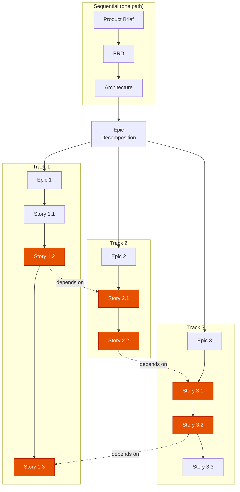

Once you decompose into epics and stories, execution fans out into parallel tracks — and stories on different tracks depend on each other. The stage-gate model doesn't account for:

- **Cross-epic dependency tracking** — Story 2.1 blocks Story 1.2, but nothing in the process models or surfaces this
- **Critical path identification** — Which story chains determine the overall timeline? Nobody knows until something slips.
- **Parallel track coordination** — When Epic 2's stories slip, what happens to Epic 3's dependent stories?
- **Convergence points** — When do the parallel tracks need to come back together, and what validates that they're coherent?

#### 3b. The human is the integration bus

In BMAD, each stage runs in a **fresh conversation** to avoid context pollution. This is a deliberate design choice — but it means the human performs every handoff. The user starts the PRD workflow, completes it, then manually starts the architecture workflow in a new session, carries over the relevant context, and so on.

The human is the step function. They decide when a phase is done, what context carries forward, which agent to invoke next, and whether the output of one stage is ready for consumption by the next. There is no session state, no handoff protocol, no automated transition. For a simple project this is manageable. For anything with multiple epics across multiple sprints, the human becomes the bottleneck *and* the single point of failure for context continuity.

If the user doesn't execute the sequence exactly as intended — and they won't, because reality intervenes — the linear chain fractures. A developer discovers mid-implementation that a requirement was wrong. The user jumps back to update the PRD, then needs to re-run architecture, then return to development — but now some stories were built against the old spec and others against the new one:

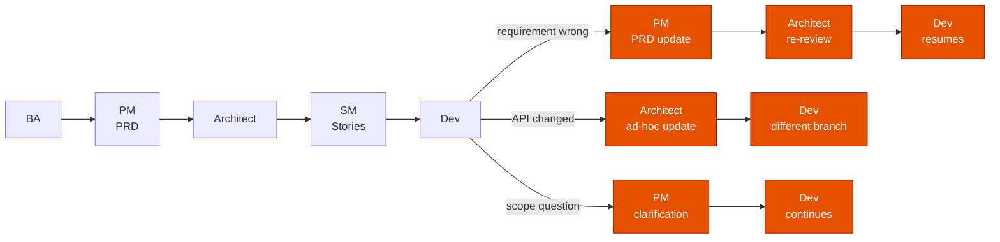

Each of those branches is the user manually creating a new conversation, loading the right context, running the right agent, and threading the results back into the main line. Nothing tracks which branch happened, what changed, or which stories are now stale. The "clean" handoff chain becomes a tangle of ad-hoc jumps — and the only record of the actual execution path is in the user's head.

Pennyfarthing solves this with **phased workflows** — automated agent-to-agent handoffs with session files tracking state across context boundaries. The SM sets up the story, TEA writes failing tests, Dev implements, Reviewer validates, and SM closes — each handoff is automated, with structured context passed through session files, not human memory. Relay mode can run the entire chain unattended.

#### 3c. Every stage uses the same flat workflow mechanism

BMAD has one workflow type: markdown files with YAML frontmatter, where the user advances through steps sequentially. Whether you're writing a product brief, running architecture decisions, executing a sprint, or doing a code review — it's the same mechanism. The user reads the step, does the work, moves to the next step.

But these activities have fundamentally different structures:

| Activity | What it needs | What BMAD provides |
|----------|--------------|-------------------|
| PRD creation | Progressive disclosure, decision gates, user approval at key points | Flat step sequence (happens to work) |
| Architecture | Collaborative exploration with multiple viewpoints (A/P/C menus) | Flat step sequence (added menus help) |
| TDD implementation | Agent handoffs: TEA writes tests, Dev implements, Reviewer checks | Flat step sequence (doesn't fit) |
| Code review | Flexible checklist, agent discretion on what to examine first | Flat step sequence (too rigid) |
| Brainstorming | Non-linear exploration, multiple techniques, no fixed order | Flat step sequence (fights the structure) |

Pennyfarthing's BikeLane engine addresses this by supporting **three distinct workflow types**, each suited to a different kind of work:

| Type | Mechanism | Suited for | Examples |
|------|-----------|-----------|----------|
| **Stepped** | Progressive disclosure, one step at a time, user gates at decision points | Planning and discovery — where human judgment drives progression | PRD, Architecture, Research, Sprint Planning |
| **Phased** | Agent-driven with automated handoffs, session state tracking | Implementation — where multiple agents need to coordinate in sequence | TDD, BDD, Trivial, Agent-Docs |
| **Procedural** | Flexible checklists, agent decides order, no fixed sequence | Reviews and exploration — where structure matters but order doesn't | Code Review, Retrospective, Brainstorming |

BMAD's stepped workflows are equivalent to Pennyfarthing's stepped type — and Pennyfarthing has already ported all nine of BMAD's Phase 1-3 planning workflows into BikeLane (see [BMAD vs Pennyfarthing](bmad-vs-pennyfarthing.md) and [BMAD Integration](../sprint/planning/bmad-integration.md)). But BMAD has no equivalent of phased or procedural workflows, which is why its implementation phase (Phase 4) is the weakest — it's trying to use a planning mechanism for execution.

Beyond workflow types, Pennyfarthing is introducing **declarative gates**: quality checkpoints defined as markdown files with structured pass/fail criteria, attached to workflow transitions. Gates can be evaluated by lightweight subagents (Haiku by default), support nesting and composition, and replace the current pattern where gate logic is buried inside agent handoff code (see [Gate Extraction Epics](../sprint/planning/gate-epics.md)). Gates are to workflow transitions what acceptance criteria are to stories — explicit, declarative, and testable.

### 4. Beyond 1.0, BMAD has no answers

BMAD's lifecycle assumes you're building something new, from scratch, once. The moment the 1.0 ships, the process has nothing to say about what comes next. Real projects don't end at deployment — they evolve, break, get feedback, and face external pressure. BMAD is completely naive about all of it:

- **Bug reports** — No process. Someone finds a bug; how does it enter the lifecycle? Where does it get triaged? How is it prioritized against feature work?
- **New feature requests** — No process. A feature request needs abbreviated discovery (not a full product brief), but BMAD has no mechanism for scoped discovery within an existing product.
- **Dependency changes** — No process. A library goes EOL. A service changes its API. A licensing model shifts. These are external forces that require impact analysis and rapid response.
- **Technical debt** — No process. Debt accumulates during implementation and needs cost/benefit analysis and scheduling alongside feature work. BMAD doesn't acknowledge it exists.
- **User feedback** — No process. Users report that something is confusing or doesn't work the way they expected. That feedback needs triage, validation, and routing to the right lifecycle phase.
- **Product direction changes** — BMAD has "course correction," but it's a single undifferentiated mechanism. A product owner pivoting strategy is a fundamentally different event than a developer discovering an API doesn't work. Both need to influence the process; neither fits through the same door.

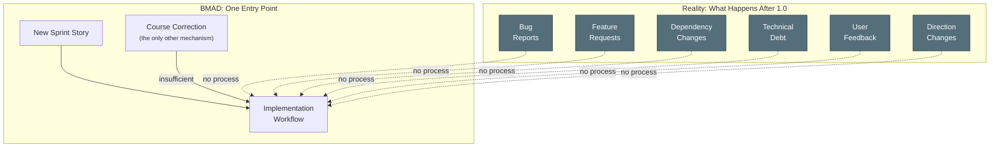

Each of these input types needs different treatment — different urgency, different triage criteria, different lifecycle entry points. BMAD funnels everything through "create a story" or, at best, a vague course correction. That's not a process. That's the absence of one.

### 5. Implementation drift has no upward channel

In the BMAD lifecycle, stories don't get delivered exactly as specified. During implementation, the team discovers that an API doesn't behave as documented, that there are state machines that weren't understood during architecture planning, or that a dependency has unrecognized constraints. The delivered story works — but it's *different* from what the PRD and architecture described.

In BMAD, that drift is invisible. The story closes, the spec stays unchanged, and the gap between "what we said we'd build" and "what we actually built" grows silently.

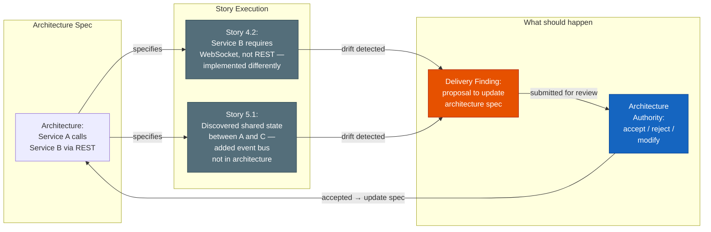

The drift doesn't have to be accepted — but it has to be *known*. Every implementation divergence should flow upward as a structured **Delivery Finding**: what changed, why, and what spec artifacts are now stale. The architecture authority reviews, and either updates the spec to match reality or flags the implementation for correction.

This is the **Finding channel** described in the [Tier Communication Protocol](lifecycle-tier-comm-protocol.md) — an upward async channel from implementation to spec authority. Without it, specs rot on contact with implementation and nobody notices until the next initiative tries to build on assumptions that are no longer true.

### 6. Changes ripple — and nothing tracks the blast radius

When a Delivery Finding *is* accepted and the architecture or PRD changes, the impact doesn't stop at the spec. It ripples outward through every epic and story in the project. Different stories are in different states, and each state requires a different response:

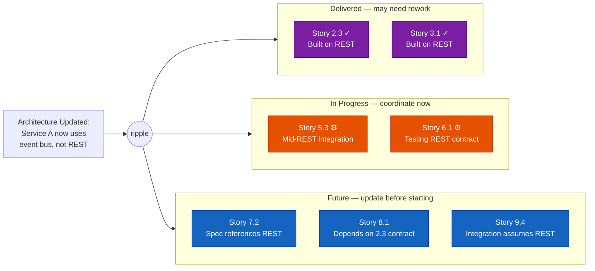

Three blast zones, three different responses — ordered from past to future:

| State | Stories | Response Required |
|-------|---------|-------------------|
| **Delivered** (purple) | Already shipped, built on the old assumption | Assess whether rework is needed. May be fine, may need a patch story. |
| **In progress** (orange) | Actively being worked, mid-implementation | Immediate coordination. The developer needs to know *now* that the ground has shifted. |
| **Future** (blue) | Not yet started, spec references stale assumptions | Update the story spec before work begins. No emergency, but the story can't start as-written. |

In BMAD, none of this tracking exists. A spec change happens and the team relies on someone's memory of which stories are affected. The ripple is invisible until a story fails in review or — worse — in production.

### 7. BMAD's process isn't composable

In BMAD, you can't:
- **Attach** a feedback collection overlay to an existing implementation workflow
- **Swap** a regulatory compliance review into the architecture phase
- **Layer** a security assessment on top of the standard code review
- **Inherit** the PRD workflow to create a "Feature Requirements" variant with reduced scope

Each BMAD workflow is standalone. Improvements to the PRD workflow don't automatically benefit a hypothetical "Feature Requirements" workflow because no inheritance mechanism exists.

### A note on scope

BMAD has problems beyond the seven listed here. Some — like the single flat workflow type (3c), the absence of automated handoffs (3b), and the lack of programmatic validation — Pennyfarthing has already solved. Others, like the organizational model assumptions and the gap between planning artifacts and execution reality, are still being explored (see [BMAD vs Pennyfarthing](bmad-vs-pennyfarthing.md) and [Gap Analysis](bmad-pennyfarthing-gap-analysis.md)).

This document is about the **lifecycle problem** specifically — not a catalog of everything wrong with spec-driven development as practiced by BMAD. BMAD was the incubator. It introduced the core ideas — agent personas, stepped workflows, structured planning artifacts — and we continue to lift innovations from it. But Brian Madison's orientation as a PMP-style process thinker constrains what BMAD can become. The framework optimizes for upfront planning discipline at the expense of execution feedback, runtime adaptation, and operational composability. Those are the gaps this proposal addresses.

---

## The Vision: What We Want

> **Early draft.** Everything below this line is initial thinking — directionally correct but not yet validated through discovery or team review. Expect significant revision.

| Section | |
|---------|---|
| **A. Complete Lifecycle Loop** | Pipeline → loop with LEARN phase |
| **B. Multiple Input Channels** | Triage six input types to the right entry point |
| **C. Fractal Lifecycle (Scale-Invariant)** | Same pattern at product, feature, and spike scale |
| **D. Research Spike as First-Class Lifecycle** | Structured exploration with fold-back |
| **E. Composable Process Architecture** | Variants, overlays, and chains |
| **Why This Matters for Spec-Driven AI** | Operational scaling with AI agents |
| **What We're Proposing to Build** | Four phased implementation tracks |
| **Success Metrics** | Measurable targets per capability |
| **What We're NOT Doing** | Scope boundaries |
| **Risks and Open Questions** | Mitigations and open decisions |
| **Industry Precedent** | Frameworks informing the design |
| **Next Steps** | Actions to move from brief to PRD |

### A. The Complete Lifecycle Loop

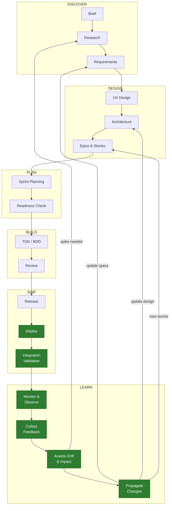

The lifecycle becomes a **loop**, not a pipeline. The LEARN phase feeds findings back to the appropriate upstream phase. An AI agent can trace the impact of a change from updated requirements through architecture, affected epics, and downstream stories — and flag what's stale.

### B. Multiple Input Channels

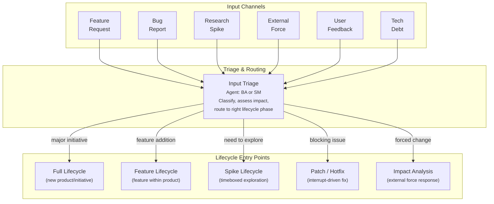

Each input type routes to the appropriate lifecycle scope. The triage step is itself a lightweight workflow — an AI agent classifying the input, assessing impact, and recommending routing.

### C. Fractal Lifecycle (Scale-Invariant)

The same lifecycle pattern repeats at different scales. Each level inherits the structure and validators from the parent but operates at reduced scope and speed.

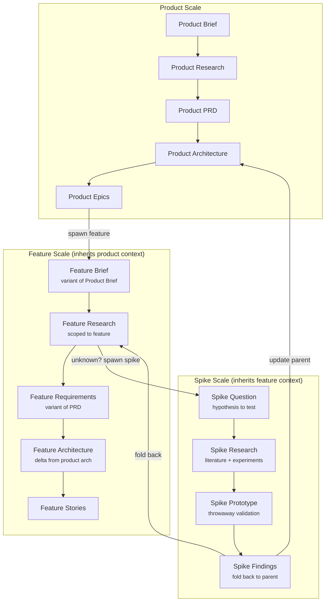

**Key principle:** A feature lifecycle is not a copy of the product lifecycle — it's a **variant** that inherits the product context (existing PRD, existing architecture) and produces deltas. When the feature's architecture diverges from the product's, the change propagation mechanism updates the parent.

### D. Research Spike as First-Class Lifecycle

A spike is not an ad-hoc exploration. It's a structured mini-lifecycle with specific deliverables:

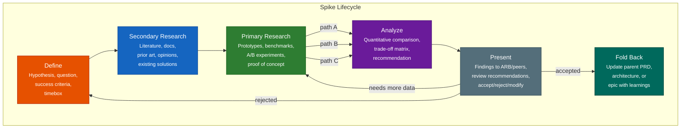

**Spike properties in an AI-agent context:**
- **Bootstrappable from parent project** — AI agent reads parent PRD/architecture, creates spike context automatically
- **Parallel path exploration** — AI agents can execute multiple prototype paths concurrently (A/B/C)
- **Structured deliverables** — Not just "we tried stuff." A spike produces: hypothesis tested, methods used, data collected, quantitative comparison, recommendation with rationale
- **Fold-back mechanism** — Standard format that updates parent project artifacts (PRD amendment, ADR, architecture delta)
- **Re-runnable with variations** — Change the hypothesis or constraints, re-run with fresh agents. The spike template is parameterized, not one-off.
- **Peer-reviewed before accepted** — Findings go to an ARB-equivalent review (could be the Reviewer agent + Architect agent in tandem) before recommendations are folded back

### E. Composable Process Architecture

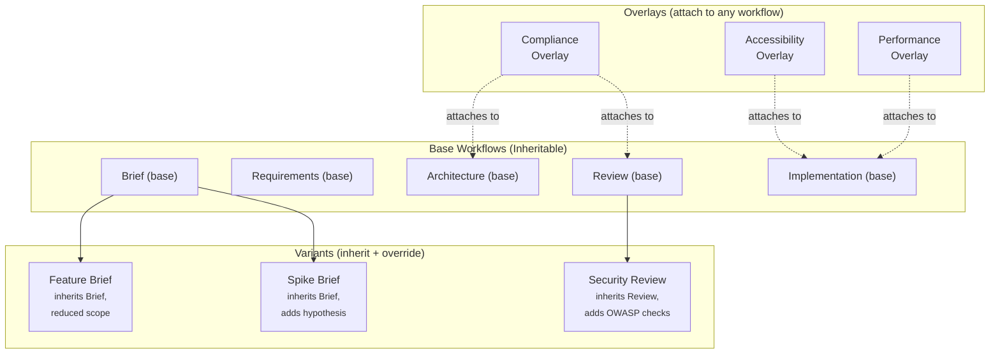

**Three composition mechanisms:**

| Mechanism | What it does | Example |
|-----------|-------------|---------|
| **Variant** | Inherits a base workflow, overrides scope/speed/depth. Improvements to base are inherited. | Feature Brief inherits Product Brief, reduces depth |
| **Overlay** | Attaches additional steps/checks to any workflow. Non-destructive. | Compliance overlay adds regulatory checks to Architecture |
| **Chain** | Sequences workflows. Output of one becomes input of next. | Spike → Feature Lifecycle → Implementation |

---

## Why This Matters for Spec-Driven AI Development

This isn't about making humans follow more checklists. This is about **AI agents operating at multiple scopes with the same spec-driven patterns.**

| Traditional Process | Spec-Driven AI Execution |
|---|---|
| Human reads PRD, interprets requirements | AI agent reads PRD spec, generates requirements programmatically |
| Human notices architectural drift in code review | AI agent traces spec→implementation divergence automatically |
| Human runs a spike by writing throwaway code | AI agent executes multiple prototype paths in parallel, benchmarks them |
| Human propagates requirement change by updating docs | AI agent traces impact from changed spec through all downstream artifacts |
| Human triages bug report and creates story | AI agent classifies input, assesses impact, routes to correct lifecycle scope |

The fractal lifecycle isn't organizational scaling (SAFe's "teams of teams"). It's **operational scaling** — the same AI agent chain (PM→Architect→TEA→Dev→Reviewer) executing at product scope, feature scope, or spike scope, driven by the same spec patterns but parameterized for different depth and speed.

**The specs are the product.** When an AI agent can read a product-level PRD and generate a feature-level requirements variant automatically, the lifecycle becomes genuinely fractal. When an AI agent can detect that implementation diverged from architecture and generate a drift report, the feedback loop closes itself. When an AI agent can bootstrap a spike from the parent project's context and fold findings back as a structured amendment, exploration becomes repeatable.

---

## What We're Proposing to Build

### Phase 1: Close the Loop

| New Workflow | Type | Agent | Purpose |
|---|---|---|---|
| **integration-validation** | Stepped | TEA + DevOps | Post-release: verify features work together, run integration tests |
| **drift-assessment** | Stepped | Architect | Compare implementation against architecture spec, flag divergence |
| **feedback-collection** | Stepped | BA | Gather and structure user/stakeholder feedback into actionable findings |
| **change-propagation** | Stepped | Architect + SM | Trace impact of spec change through all downstream artifacts |

### Phase 2: Multiple Input Channels

| New Workflow | Type | Agent | Purpose |
|---|---|---|---|
| **input-triage** | Stepped | BA or SM | Classify incoming work (feature/bug/spike/external/debt), route to correct lifecycle |
| **impact-analysis** | Stepped | Architect + BA | Assess impact of external force (dependency EOL, CVE, licensing change) |
| **debt-assessment** | Stepped | Architect + Dev | Quantify technical debt, produce cost/benefit analysis for scheduling |

### Phase 3: Fractal Lifecycle

| New Workflow | Type | Agent | Purpose |
|---|---|---|---|
| **feature-brief** | Stepped (variant of product-brief) | PM/BA | Abbreviated discovery scoped to feature within existing product |
| **feature-requirements** | Stepped (variant of prd) | PM | Feature-scoped requirements inheriting product PRD context |
| **feature-architecture** | Stepped (variant of architecture) | Architect | Architecture delta from product architecture |
| **spike** | Stepped | Architect + Dev | Structured exploration with parallel paths and fold-back |

### Phase 4: Composability

| Capability | Type | Purpose |
|---|---|---|
| **Workflow inheritance** | Engine enhancement | Variants inherit base workflow steps, override what's different |
| **Overlay attachment** | Engine enhancement | Attach additional steps/checks to any workflow non-destructively |
| **Chain composition** | Engine enhancement | Sequence workflows, output→input piping |
| **Scope parameterization** | Engine enhancement | Same workflow at product/feature/component/spike scale |

---

## Success Metrics

| Metric | Current State | Target |
|---|---|---|
| Post-ship lifecycle coverage | 0 workflows | 4 workflows (validate, drift, feedback, propagate) |
| Input channel coverage | 1 (new story) | 6 (feature, bug, spike, external, feedback, debt) |
| Lifecycle scales supported | 1 (product) | 4 (product, feature, spike, component) |
| Spec-to-implementation drift detection | Manual/ad-hoc | Automated per-release |
| Spike fold-back to parent project | Informal | Structured with standard deliverables |
| Requirement change impact tracing | None | Automated downstream artifact flagging |

---

## What We're Explicitly NOT Doing

- **Not building a project management tool** — BikeLane orchestrates AI agents, not human task boards
- **Not replacing Jira** — Jira remains the external tracking system; BikeLane is the execution engine
- **Not making the process heavier** — Variants and overlays should reduce ceremony for smaller scopes, not add it
- **Not requiring all phases for all work** — The triage step routes to the *minimum viable lifecycle* for each input type
- **Not changing existing working workflows** — TDD, BDD, Trivial, Release are stable. We're extending, not replacing.

---

## Risks and Open Questions

| Risk | Mitigation |
|---|---|
| Over-engineering: composability adds complexity to BikeLane engine | Start with variants (YAML inheritance) before overlays (runtime attachment) |
| Scope creep: "complete lifecycle" could mean anything | Phase the work. Close the loop first (Phase 1), then add inputs, then fractal, then composability |
| AI agent context limits: fractal context (product + feature + spike) may exceed windows | BikeLane already manages context budgets per agent; fractal scoping needs the same discipline |
| Change propagation could be noisy | Drift assessment should classify changes as intentional (accepted drift) vs accidental (needs correction) |

| Open Question | Who Decides |
|---|---|
| Should spike findings require human approval before fold-back, or can AI agents auto-merge? | PM + Architect |
| What's the minimum viable "feature lifecycle" — how many steps can we skip? | BA discovery needed |
| Should overlays be defined in YAML or as separate workflow files? | Architect |
| How do we handle conflicting feedback from multiple input channels? | PM prioritization (WSJF or similar) |

---

## Industry Precedent

This proposal draws on established frameworks:

| Concept | Framework | How We Use It |
|---|---|---|
| Fractal process repetition | SAFe (Agile Release Train as fractal of Team) | Same lifecycle at product/feature/spike scale |
| Architectural fitness functions | "Building Evolutionary Architectures" (Ford/Parsons) | Automated drift detection against architecture spec |
| Timeboxed research spikes | XP (Extreme Programming), SAFe Spikes | Structured spike lifecycle with fold-back |
| Progressive Spike-Driven Development | PSDD (Ordisoftware) | Structured alternation of exploration, validation, refinement |
| Change impact analysis | Regulatory Lifecycle Management | Trace requirement changes through downstream artifacts |
| Continuous feedback loops | DevOps feedback taxonomy | Multiple feedback types feeding back to appropriate lifecycle phase |
| WSJF prioritization | SAFe | Triage and prioritize inputs from multiple channels |
| Process inheritance | Object-oriented design patterns | Workflow variants inherit from base, override as needed |

---

## Next Steps

1. **Review this brief with the team** — Keith, Mike R, Musthaq
2. **Discovery on spike lifecycle** — BA deep-dive on what "good spike deliverables" look like for our AI-driven context
3. **Prototype workflow inheritance in BikeLane** — Can we make a YAML variant that extends a base workflow?
4. **Map the "LEARN" phase agents** — Which existing agents (BA, Architect, SM) own which feedback loop steps?
5. **Write the full PRD** — After brief is accepted, use the `prd` stepped workflow to formalize requirements
