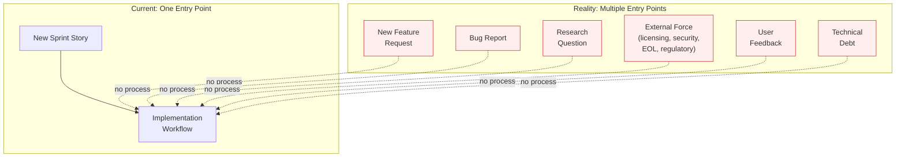
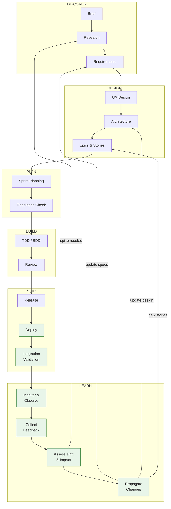
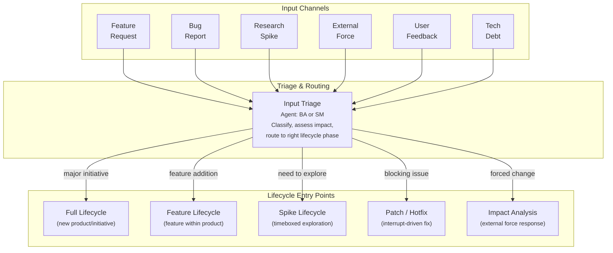
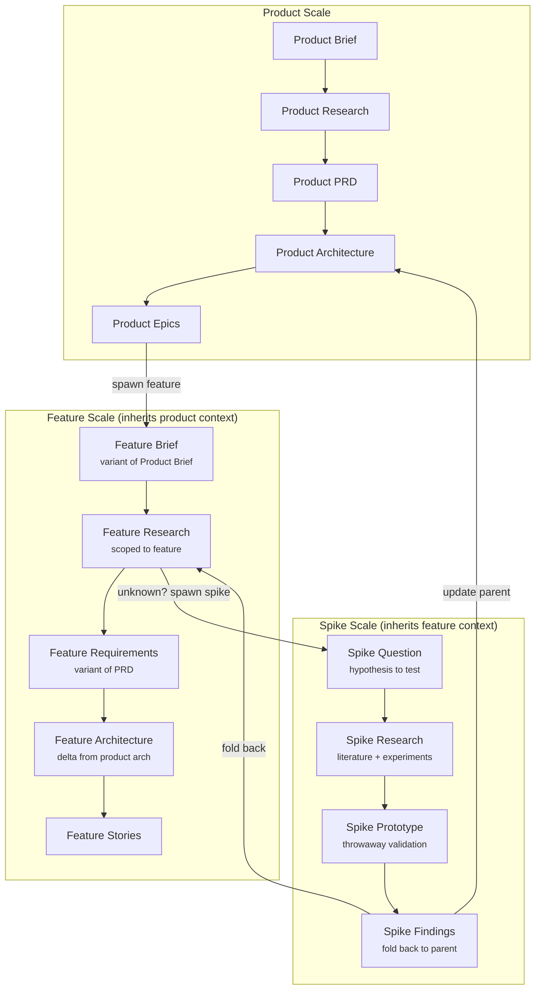
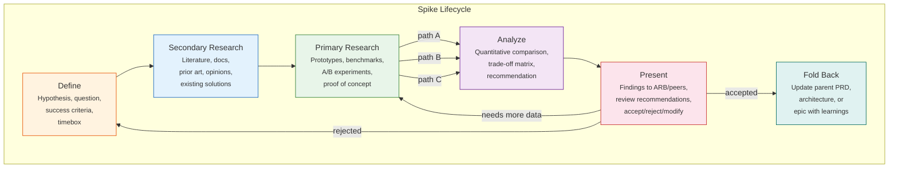
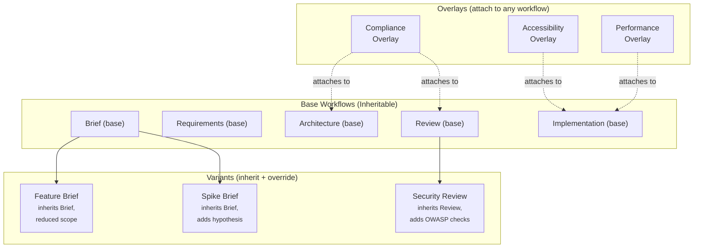

# Product Brief: Composable Lifecycle Engine

**Author:** Michael Pursifull (BA discovery by Avasarala)
**Date:** 2026-02-14
**Status:** Draft — For Team Review
**Context:** Spec-driven development with AI agent execution (Pennyfarthing/BikeLane)

---

## The Problem in One Sentence

The BikeLane product lifecycle is a one-way street with one front door: it starts at "product brief," ends at "story shipped," has no feedback loops, no way to handle external change, no mechanism for exploration, and no way to run the same process at different scales.

---

## What's Actually Broken

### 1. The lifecycle is incomplete — it stops at "shipped"

```mermaid
graph LR
    subgraph "What BikeLane covers today"
        PB["Product<br/>Brief"] --> R["Research"] --> PRD["PRD"] --> ARCH["Architecture"]
        ARCH --> ES["Epics &<br/>Stories"] --> SP["Sprint<br/>Planning"] --> IMPL["TDD/BDD<br/>Implementation"]
        IMPL --> REL["Release"]
    end

    subgraph "What happens next (not covered)"
        INT["Integration<br/>Validation"]
        DRIFT["Architectural<br/>Drift Detection"]
        FB["User<br/>Feedback"]
        LEARN["Learning<br/>Capture"]
        PROP["Change<br/>Propagation"]
    end

    REL -.->|"???"| INT
    INT -.->|"???"| DRIFT
    DRIFT -.->|"???"| FB
    FB -.->|"???"| LEARN
    LEARN -.->|"???"| PROP
    PROP -.->|"should feed back"| PRD

    style INT fill:#fee,stroke:#c33
    style DRIFT fill:#fee,stroke:#c33
    style FB fill:#fee,stroke:#c33
    style LEARN fill:#fee,stroke:#c33
    style PROP fill:#fee,stroke:#c33
```

After release, there is no structured process for:
- **Integration validation** — Did the features actually work together?
- **Architectural drift** — Did implementation diverge from the architecture? Is that okay?
- **Learning capture** — What did we learn that should update the PRD or Architecture?
- **Change propagation** — When a spec changes, what downstream artifacts are now stale?

The lifecycle is a pipeline, not a loop. In practice, teams handle post-ship work through ad-hoc heroics.

### 2. There's one front door, but reality has six

Today, everything enters through "someone creates a sprint story." But different input types need different treatment:
- A **feature request** needs abbreviated discovery (not a full product brief)
- A **research spike** needs exploration with structured deliverables and fold-back
- An **external force** (dependency EOL, licensing change, CVE) needs impact analysis and rapid response
- **User feedback** needs triage, validation, and routing to the right lifecycle phase
- **Technical debt** needs cost/benefit analysis and scheduling alongside feature work

### 3. The process doesn't scale down

The full lifecycle (product brief → PRD → architecture → epics → stories → TDD) is appropriate for a new product or major initiative. But what about:

- A **feature** within an existing product? The product brief exists. The PRD exists. You need a *feature brief*, *feature requirements*, and *feature architecture* — same structure, reduced scope.
- A **research spike**? You need rapid, timeboxed exploration that produces structured findings — not production code — that fold back into the main project.
- A **component change**? Even smaller. Same quality gates, but lighter-weight artifacts.

The lifecycle should be **fractal** — the same pattern repeating at different scales, inheriting the structure and validators from the parent scope, using variants of the same specs rather than entirely separate documents.

### 4. The process isn't composable

You can't:
- **Attach** a feedback collection overlay to an existing implementation workflow
- **Swap** a regulatory compliance review into the architecture phase
- **Layer** a security assessment on top of the standard code review
- **Inherit** the PRD workflow to create a "Feature Requirements" variant with reduced scope

Each workflow is standalone. Improvements to the PRD workflow don't automatically benefit a hypothetical "Feature Requirements" workflow because no inheritance mechanism exists.

---

## The Vision: What We Want

### A. The Complete Lifecycle Loop

The lifecycle becomes a **loop**, not a pipeline. The LEARN phase feeds findings back to the appropriate upstream phase. An AI agent can trace the impact of a change from updated requirements through architecture, affected epics, and downstream stories — and flag what's stale.

### B. Multiple Input Channels

Each input type routes to the appropriate lifecycle scope. The triage step is itself a lightweight workflow — an AI agent classifying the input, assessing impact, and recommending routing.

### C. Fractal Lifecycle (Scale-Invariant)

The same lifecycle pattern repeats at different scales. Each level inherits the structure and validators from the parent but operates at reduced scope and speed.

**Key principle:** A feature lifecycle is not a copy of the product lifecycle — it's a **variant** that inherits the product context (existing PRD, existing architecture) and produces deltas. When the feature's architecture diverges from the product's, the change propagation mechanism updates the parent.

### D. Research Spike as First-Class Lifecycle

A spike is not an ad-hoc exploration. It's a structured mini-lifecycle with specific deliverables:

**Spike properties in an AI-agent context:**
- **Bootstrappable from parent project** — AI agent reads parent PRD/architecture, creates spike context automatically
- **Parallel path exploration** — AI agents can execute multiple prototype paths concurrently (A/B/C)
- **Structured deliverables** — Not just "we tried stuff." A spike produces: hypothesis tested, methods used, data collected, quantitative comparison, recommendation with rationale
- **Fold-back mechanism** — Standard format that updates parent project artifacts (PRD amendment, ADR, architecture delta)
- **Re-runnable with variations** — Change the hypothesis or constraints, re-run with fresh agents. The spike template is parameterized, not one-off.
- **Peer-reviewed before accepted** — Findings go to an ARB-equivalent review (could be the Reviewer agent + Architect agent in tandem) before recommendations are folded back

### E. Composable Process Architecture

**Three composition mechanisms:**

| Mechanism | What it does | Example |
|-----------|-------------|---------|
| **Variant** | Inherits a base workflow, overrides scope/speed/depth. Improvements to base are inherited. | Feature Brief inherits Product Brief, reduces depth |
| **Overlay** | Attaches additional steps/checks to any workflow. Non-destructive. | Compliance overlay adds regulatory checks to Architecture |
| **Chain** | Sequences workflows. Output of one becomes input of next. | Spike → Feature Lifecycle → Implementation |

---

## Why This Matters for Spec-Driven AI Development

This isn't about making humans follow more checklists. This is about **AI agents operating at multiple scopes with the same spec-driven patterns.**

| Traditional Process | Spec-Driven AI Execution |
|---|---|
| Human reads PRD, interprets requirements | AI agent reads PRD spec, generates requirements programmatically |
| Human notices architectural drift in code review | AI agent traces spec→implementation divergence automatically |
| Human runs a spike by writing throwaway code | AI agent executes multiple prototype paths in parallel, benchmarks them |
| Human propagates requirement change by updating docs | AI agent traces impact from changed spec through all downstream artifacts |
| Human triages bug report and creates story | AI agent classifies input, assesses impact, routes to correct lifecycle scope |

The fractal lifecycle isn't organizational scaling (SAFe's "teams of teams"). It's **operational scaling** — the same AI agent chain (PM→Architect→TEA→Dev→Reviewer) executing at product scope, feature scope, or spike scope, driven by the same spec patterns but parameterized for different depth and speed.

**The specs are the product.** When an AI agent can read a product-level PRD and generate a feature-level requirements variant automatically, the lifecycle becomes genuinely fractal. When an AI agent can detect that implementation diverged from architecture and generate a drift report, the feedback loop closes itself. When an AI agent can bootstrap a spike from the parent project's context and fold findings back as a structured amendment, exploration becomes repeatable.

---

## What We're Proposing to Build

### Phase 1: Close the Loop

| New Workflow | Type | Agent | Purpose |
|---|---|---|---|
| **integration-validation** | Stepped | TEA + DevOps | Post-release: verify features work together, run integration tests |
| **drift-assessment** | Stepped | Architect | Compare implementation against architecture spec, flag divergence |
| **feedback-collection** | Stepped | BA | Gather and structure user/stakeholder feedback into actionable findings |
| **change-propagation** | Stepped | Architect + SM | Trace impact of spec change through all downstream artifacts |

### Phase 2: Multiple Input Channels

| New Workflow | Type | Agent | Purpose |
|---|---|---|---|
| **input-triage** | Stepped | BA or SM | Classify incoming work (feature/bug/spike/external/debt), route to correct lifecycle |
| **impact-analysis** | Stepped | Architect + BA | Assess impact of external force (dependency EOL, CVE, licensing change) |
| **debt-assessment** | Stepped | Architect + Dev | Quantify technical debt, produce cost/benefit analysis for scheduling |

### Phase 3: Fractal Lifecycle

| New Workflow | Type | Agent | Purpose |
|---|---|---|---|
| **feature-brief** | Stepped (variant of product-brief) | PM/BA | Abbreviated discovery scoped to feature within existing product |
| **feature-requirements** | Stepped (variant of prd) | PM | Feature-scoped requirements inheriting product PRD context |
| **feature-architecture** | Stepped (variant of architecture) | Architect | Architecture delta from product architecture |
| **spike** | Stepped | Architect + Dev | Structured exploration with parallel paths and fold-back |

### Phase 4: Composability

| Capability | Type | Purpose |
|---|---|---|
| **Workflow inheritance** | Engine enhancement | Variants inherit base workflow steps, override what's different |
| **Overlay attachment** | Engine enhancement | Attach additional steps/checks to any workflow non-destructively |
| **Chain composition** | Engine enhancement | Sequence workflows, output→input piping |
| **Scope parameterization** | Engine enhancement | Same workflow at product/feature/component/spike scale |

---

## Success Metrics

| Metric | Current State | Target |
|---|---|---|
| Post-ship lifecycle coverage | 0 workflows | 4 workflows (validate, drift, feedback, propagate) |
| Input channel coverage | 1 (new story) | 6 (feature, bug, spike, external, feedback, debt) |
| Lifecycle scales supported | 1 (product) | 4 (product, feature, spike, component) |
| Spec-to-implementation drift detection | Manual/ad-hoc | Automated per-release |
| Spike fold-back to parent project | Informal | Structured with standard deliverables |
| Requirement change impact tracing | None | Automated downstream artifact flagging |

---

## What We're Explicitly NOT Doing

- **Not building a project management tool** — BikeLane orchestrates AI agents, not human task boards
- **Not replacing Jira** — Jira remains the external tracking system; BikeLane is the execution engine
- **Not making the process heavier** — Variants and overlays should reduce ceremony for smaller scopes, not add it
- **Not requiring all phases for all work** — The triage step routes to the *minimum viable lifecycle* for each input type
- **Not changing existing working workflows** — TDD, BDD, Trivial, Release are stable. We're extending, not replacing.

---

## Risks and Open Questions

| Risk | Mitigation |
|---|---|
| Over-engineering: composability adds complexity to BikeLane engine | Start with variants (YAML inheritance) before overlays (runtime attachment) |
| Scope creep: "complete lifecycle" could mean anything | Phase the work. Close the loop first (Phase 1), then add inputs, then fractal, then composability |
| AI agent context limits: fractal context (product + feature + spike) may exceed windows | BikeLane already manages context budgets per agent; fractal scoping needs the same discipline |
| Change propagation could be noisy | Drift assessment should classify changes as intentional (accepted drift) vs accidental (needs correction) |

| Open Question | Who Decides |
|---|---|
| Should spike findings require human approval before fold-back, or can AI agents auto-merge? | PM + Architect |
| What's the minimum viable "feature lifecycle" — how many steps can we skip? | BA discovery needed |
| Should overlays be defined in YAML or as separate workflow files? | Architect |
| How do we handle conflicting feedback from multiple input channels? | PM prioritization (WSJF or similar) |

---

## Industry Precedent

This proposal draws on established frameworks:

| Concept | Framework | How We Use It |
|---|---|---|
| Fractal process repetition | SAFe (Agile Release Train as fractal of Team) | Same lifecycle at product/feature/spike scale |
| Architectural fitness functions | "Building Evolutionary Architectures" (Ford/Parsons) | Automated drift detection against architecture spec |
| Timeboxed research spikes | XP (Extreme Programming), SAFe Spikes | Structured spike lifecycle with fold-back |
| Progressive Spike-Driven Development | PSDD (Ordisoftware) | Structured alternation of exploration, validation, refinement |
| Change impact analysis | Regulatory Lifecycle Management | Trace requirement changes through downstream artifacts |
| Continuous feedback loops | DevOps feedback taxonomy | Multiple feedback types feeding back to appropriate lifecycle phase |
| WSJF prioritization | SAFe | Triage and prioritize inputs from multiple channels |
| Process inheritance | Object-oriented design patterns | Workflow variants inherit from base, override as needed |

---

## Next Steps

1. **Review this brief with the team** — Keith, Mike R, Musthaq
2. **Discovery on spike lifecycle** — BA deep-dive on what "good spike deliverables" look like for our AI-driven context
3. **Prototype workflow inheritance in BikeLane** — Can we make a YAML variant that extends a base workflow?
4. **Map the "LEARN" phase agents** — Which existing agents (BA, Architect, SM) own which feedback loop steps?
5. **Write the full PRD** — After brief is accepted, use the `prd` stepped workflow to formalize requirements
