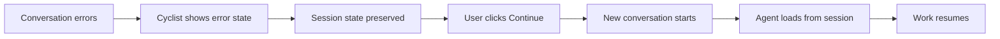
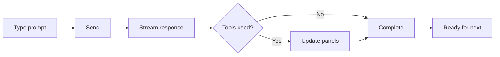
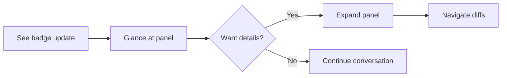

---
stepsCompleted:
  - step-01-init
  - step-02-discovery
  - step-03-core-experience
  - step-04-emotional-response
  - step-05-inspiration
  - step-06-design-system
  - step-07-defining-experience
  - step-08-visual-foundation
  - step-09-design-directions
  - step-10-user-journeys
  - step-11-component-strategy
  - step-12-ux-patterns
  - step-13-responsive-accessibility
  - step-14-complete
status: complete
completedAt: 2026-01-31
inputDocuments:
  - pennyfarthing/packages/cyclist/src/public/index.html
  - pennyfarthing/packages/cyclist/src/public/styles.css
  - docs/planning/prd.md
mode: brownfield
---

# UX Design Specification: Cyclist

**Author:** Cleopatra (UX Designer)
**Date:** 2026-01-31
**Mode:** Brownfield Baseline

---

## 1. Executive Summary

This document establishes the baseline UX design for **Cyclist**, the visual terminal for Claude Code agent orchestration. Cyclist is an Electron-based desktop application that provides a graphical interface for managing AI agent workflows, viewing conversation history, and controlling permissions.

**Purpose:** Document current state before improvements.

---

## 2. Current Architecture

### 2.1 Application Structure

```
+------------------------------------------------------------------+
| Tab Bar (40px)                                                     |
| [CHANGED] [DIFFS] [DEBUG] ...        [Permission] [Model: opus]   |
+------------------------------------------------------------------+
| Content Area (flex row)                                            |
| +-------------+---+-------------+---+---------------------------+  |
| | Left Panels | R | Center      | R | Right Panels              |  |
| | (collapsible| E | Message     | E | (vertical tabs)           |  |
| | stacked)    | S | Panel       | S |                           |  |
| |             | I |             | I | Sprint / Progress /       |  |
| | Changed     | Z |             | Z | Background / Git /        |  |
| | Diffs       | E |             | E | Settings                  |  |
| | Debug       |   |             |   |                           |  |
| +-------------+---+-------------+---+---------------------------+  |
+------------------------------------------------------------------+
```

### 2.2 Panel Inventory

| Panel | Position | Purpose | Default State |
|-------|----------|---------|---------------|
| Changed Files | Left | Show modified files | Collapsed |
| Diffs | Left | Show file diffs with navigation | Collapsed |
| Debug | Left | OTEL span viewer | Collapsed |
| Message | Center | Main conversation view | Always visible |
| Sprint | Right | Story/sprint status | Collapsed |
| Progress | Right | Todos + Bikelane workflow | Collapsed |
| Background | Right | Background task monitoring | Collapsed |
| Git | Right | Git status per repo | Collapsed |
| Settings | Right | Theme picker, input settings | Collapsed |

---

## 3. Design System

### 3.1 Color Palette (Dark Theme)

| Token | Value | Usage |
|-------|-------|-------|
| `--bg-primary` | `#1a1a2e` | Main background |
| `--bg-secondary` | `#16213e` | Panel headers, tab bar |
| `--bg-terminal` | `#0f0f1a` | Terminal/code areas |
| `--text-primary` | `#e4e4e7` | Main text |
| `--text-secondary` | `#a1a1aa` | Labels, muted text |
| `--accent` | `#4f46e5` | Active states, highlights |
| `--border` | `#27272a` | Borders, dividers |
| `--status-ready` | `#22c55e` | Success states |
| `--status-working` | `#f59e0b` | In-progress states |
| `--status-error` | `#ef4444` | Error states |

### 3.2 Typography

| Element | Font | Size | Weight |
|---------|------|------|--------|
| Body | System UI | 14px | 400 |
| Tab labels | System UI | 11px | 600 |
| Panel titles | System UI | 12px | 600 |
| Code | Monospace | 13px | 400 |

### 3.3 Spacing & Layout

| Token | Value |
|-------|-------|
| `--sidebar-width` | 300px |
| `--panel-min-width` | 150px |
| `--panel-default-width` | 280px |
| Tab bar height | 40px |
| Panel header padding | 8px 12px |
| Resize handle width | 4px |

---

## 4. Component Catalog

### 4.1 Tab Bar

**Location:** Top of application
**Purpose:** Panel navigation and status indicators

```
[CHANGED (3)] [DIFFS (5)] [DEBUG]        [! 2] [opus-4]
    ^tabs with badges^                   ^permission^  ^model^
```

**States:**
- Default: Secondary text, transparent background
- Hover: Primary text, subtle background
- Active: Primary text, accent bottom border
- Badge: Pill with count when content available

### 4.2 Collapsible Panels

**Behavior:**
- Collapse: Width transitions to 0, opacity to 0
- Expand: Width transitions to stored value
- Resize: Drag handle between panels

**CSS Pattern:**
```css
.panel.collapsed {
  width: 0 !important;
  min-width: 0 !important;
  opacity: 0;
  pointer-events: none;
}
```

### 4.3 Mode Switch (3-way Segmented Control)

**Location:** Editor toolbar
**Options:** PLAN | MANUAL | ACCEPT

**Behavior:**
- Sliding highlight follows active segment
- Keyboard shortcuts: Cmd+1, Cmd+2, Cmd+3
- Tooltip on hover explains each mode

### 4.4 Stats Strip

**Location:** Below editor
**Content:** PWD | Jira | GitHub | Model | Context %

**Layout:**
- Left: Identity context (pwd, jira email, github user)
- Right: Model badge, context mini-bar with percentage

### 4.5 Modals

| Modal | Purpose | Trigger |
|-------|---------|---------|
| Tool Approval | Approve bash/edit operations | Permission request |
| Dangerous Path | Warn on sensitive file access | .env, credentials |
| Audit Log | View tool execution history | Menu |
| Persona Popup | Character details + team roster | Portrait click |
| Confirm Dialog | Generic confirmation | Various |

---

## 5. User Flows

### 5.1 Agent Activation

```
User → /agent command → Persona Header updates → Message View shows context
```

### 5.2 Panel Navigation

```
User → Click tab → Panel expands → Other panels in same position collapse
```

### 5.3 Permission Approval

```
Claude requests tool → Modal appears → User approves/rejects → Tool executes
```

### 5.4 Diff Review

```
Edit occurs → Diffs panel badge updates → User opens panel →
Navigate with < > or Partial/Combined view
```

---

## 6. Accessibility Status

### 6.1 Current Implementation

- ARIA roles on tabs and modals
- Keyboard shortcuts for mode switching
- Focus management in modals
- Color contrast meets WCAG AA (status-working adjusted)

### 6.2 Known Gaps

- Screen reader announcements incomplete
- Focus trapping in some modals
- Keyboard navigation between panels

---

## 7. Responsive Behavior

**Current:** Fixed desktop layout, no responsive breakpoints

**Constraints:**
- Minimum window size enforced by Electron
- Panels resize via drag handles
- No mobile support (Electron desktop app)

---

## 8. Identified Patterns

### 8.1 Collapsible Section

```html
<section class="collapsible-section collapsed">
  <div class="section-header" data-action="toggle">
    <span class="section-title">TITLE</span>
    <span class="section-summary">(n items)</span>
    <button class="collapse-btn">▼</button>
  </div>
  <div class="section-content">...</div>
</section>
```

### 8.2 Panel with Badge

```html
<aside id="x-panel" class="vertical-panel collapsed">
  <div class="panel-header">
    <span class="panel-title">X</span>
    <span class="panel-badge"></span>
  </div>
  <div class="panel-content section-content">...</div>
</aside>
```

### 8.3 Toggle Button Group

```html
<div class="setting-toggle-group" role="radiogroup">
  <button class="toggle-btn" data-value="on">On</button>
  <button class="toggle-btn" data-value="off">Off</button>
</div>
```

---

## 9. Technology Stack

| Layer | Technology |
|-------|------------|
| Runtime | Electron |
| Frontend | Vanilla JS (ES modules) |
| Styling | CSS (single styles.css, ~2400 lines) |
| State | Window globals + localStorage |
| Communication | WebSocket to WheelHub server |

---

## 10. Next Steps

With the baseline documented, potential improvements include:

1. **Component library extraction** - Reusable patterns currently duplicated
2. **CSS organization** - Single file is large; consider modular approach
3. **State management** - Window globals → proper state container
4. **Accessibility audit** - Full WCAG 2.1 AA compliance
5. **Design tokens** - CSS variables could be more comprehensive

---

## 11. Project Understanding

### 11.1 Project Vision

Evolve Cyclist from fixed panel positions to a flexible, user-configurable layout system while maintaining the message view as the sacred center. Users should be able to arrange their workspace to match their workflow, with layouts persisted per-project.

### 11.2 Target Users

- **Primary:** Developers and engineers using Claude Code for AI-assisted development
- **Context:** Power users comfortable with terminal interfaces, VS Code, and developer tooling
- **Tech Level:** High - software professionals who expect customizable tools
- **Preferences:** Highly varied - some want minimal chrome, others want rich dashboards

### 11.3 Key Design Challenges

| Challenge | Current State | Impact |
|-----------|---------------|--------|
| Fixed panel positions | Panels locked to left/right | Wastes horizontal space, underutilizes vertical |
| One-size-fits-none | Same layout for all users | Doesn't accommodate different workflows |
| Keybinding conflicts | Cmd+R bound, blocking refresh | Frustrating, unpredictable behavior |
| No layout persistence | Partial implementation | Users must reconfigure each session |

### 11.4 Design Opportunities

1. **Draggable/resizable sidebars** with tabbed panels
2. **Per-project layout persistence** in `.pennyfarthing/config.local.yaml`
3. **Rationalized keybinding system** with clear conventions (never override system defaults)
4. **Respect user preferences** without preset complexity

### 11.5 Target Layout Model

```
+------------------+---------------------------+------------------+
| Left Sidebar     |      Message View         | Right Sidebar    |
| (panels/tabs)    |      (ALWAYS CENTER)      | (panels/tabs)    |
|                  |                           |                  |
| [draggable]      |      [fixed position]     | [draggable]      |
| [collapsible]    |                           | [collapsible]    |
| [resizable]      |                           | [resizable]      |
+------------------+---------------------------+------------------+
```

**Constraints:**
- Message view is sacred - never moves
- Sidebars are optional and collapsible
- Panels can be moved between sidebars
- Panels can be tabbed within a sidebar
- Layout saved per-project folder

### 11.6 Keybinding Principles

1. **Never override system defaults** (Cmd+R, Cmd+W, Cmd+Q, etc.)
2. **Use Cmd+Shift+* prefix** for Cyclist-specific actions
3. **Audit and document** all current bindings
4. **Allow user customization** (future consideration)

### 11.7 Library Candidates

For flexible docking/layout system:

| Library | Fit | Notes |
|---------|-----|-------|
| **FlexLayout** | High | React, VS Code-like tabs + docking |
| **Dockview** | High | Modern, lightweight, React/vanilla |
| **Golden Layout** | Medium | Mature, may be overkill |
| **Lumino** | Medium | JupyterLab's solution |

---

## 12. Core User Experience

### 12.1 Defining Experience

The core Cyclist experience is **reading AI output while maintaining awareness of codebase changes**. Users spend most time consuming Claude's responses - this must be frictionless and optimized for scanning long technical content.

### 12.2 Platform Strategy

| Aspect | Decision |
|--------|----------|
| **Platform** | Electron desktop application |
| **Input** | Mouse/keyboard primary, no touch |
| **Offline** | Not required (Claude API dependent) |
| **Performance** | Must match native app responsiveness |

### 12.3 Effortless Interactions

| Interaction | Current State | Target State |
|-------------|---------------|--------------|
| Reading messages | Adequate | Optimized for scanning |
| Editor input | Can lag | Zero perceptible latency |
| Permission approval | Blocking | Non-blocking or auto-trust |
| Finding changes | Manual panel navigation | Ambient, always visible |
| Layout adjustment | Limited | Drag-drop, remembered |

### 12.4 Critical Success Moments

1. **The Reveal** - User sees all files Claude modified at a glance
2. **The Trust** - User approves once, similar actions flow through
3. **The Impossible** - User accomplishes something terminal can't do
4. **The Recovery** - User finds exactly what changed after stepping away

### 12.5 Experience Principles

| Principle | Description |
|-----------|-------------|
| **Reading First** | Message view is sacred; every pixel serves comprehension |
| **Ambient Awareness** | Show everything, interrupt nothing |
| **Zero-Friction Input** | Editor response must be imperceptible |
| **Trust Momentum** | Build trust, don't break flow |
| **Codebase X-Ray** | Always know what AI touched, where, why |

---

## 13. Desired Emotional Response

### 13.1 Primary Emotional Goal

**Unimpeded Productivity** - Developers want to do their work. The tool should be invisible, letting work be the foreground. Success is when users forget they're using a tool and just... work.

### 13.2 Emotional Journey

| Stage | Target Feeling | Design Implication |
|-------|----------------|-------------------|
| First open | "This makes sense" | Familiar patterns, no learning curve |
| During work | "I'm in flow" | No interruptions, ambient info only |
| After completion | "That was easy" | Clear confirmation, no lingering doubt |
| Something fails | "I can recover" | Obvious undo, nothing truly lost |
| Returning | "Right where I left off" | Session persistence, context restored |

### 13.3 Critical Micro-Emotions

| Positive | Negative to Avoid |
|----------|-------------------|
| Confidence | Anxiety about lost work |
| Trust | Distrust of AI actions |
| Flow | Interruption frustration |
| Predictability | Surprise/confusion |

### 13.4 The Core Fear

**Losing work** is the developer's nightmare. Every UX decision must reinforce that work is safe:

- Undo always available
- Git status always visible
- Diffs preserved in history
- Session survives crashes
- Changes recoverable

### 13.5 Emotional Design Principles

| Principle | Description |
|-----------|-------------|
| **Invisible When Working** | Tool fades, work dominates |
| **Obvious When It Matters** | Critical info surfaces, noise doesn't |
| **Safe by Default** | Nothing destructive without confirmation |
| **Recoverable Always** | Every action has an undo path |
| **Predictable Behavior** | Same input, same output, every time |

---

## 14. UX Pattern Analysis & Inspiration

### 14.1 Inspiring Products

| Product | Why It Inspires |
|---------|-----------------|
| **VS Code** | Panel system, command palette, extension model |
| **Windsurf** | AI-native design, minimal chrome |
| **vi** | Keyboard efficiency, modal thinking |
| **Slack** | Chat-centric UX, threading, notifications |
| **macOS** | Native feel, system shortcuts, gestures |

### 14.2 User Context

- All users on Claude (understand AI agent interaction)
- All use Slack (familiar with chat-based interfaces)
- All use Mac laptops (macOS conventions are muscle memory)

### 14.3 Transferable Patterns

| Pattern | Source | Application to Cyclist |
|---------|--------|------------------------|
| Command Palette | VS Code | Cmd+Shift+P for all actions |
| Keyboard-First | vi | Every action has a shortcut |
| Chat as Primary | Slack | Message view is the interface |
| AI-Native | Windsurf | AI is core, not add-on |
| Mac-Native | macOS | Respect system conventions |

### 14.4 Anti-Patterns to Avoid

| Anti-Pattern | Why Avoid |
|--------------|-----------|
| Override macOS shortcuts | Violates Cmd+R, Cmd+W muscle memory |
| Require mouse for common actions | vi/keyboard users will hate it |
| Treat AI as sidebar/add-on | AI is center, not peripheral |
| Complex nested menus | Command palette beats menus |
| Electron that feels non-native | Should feel like a Mac app |

### 14.5 Design Inspiration Strategy

| Strategy | Details |
|----------|---------|
| **Adopt** | Command palette, keyboard shortcuts, chat-centric layout |
| **Adapt** | VS Code panels → simpler left/right sidebars with tabs |
| **Avoid** | Electron bloat, non-native feel, mouse-dependent UX |

---

## 15. Design System Foundation

### 15.1 Design System Choice

| Decision | Selection |
|----------|-----------|
| **Framework** | React |
| **Component Library** | shadcn/ui |
| **Styling** | Tailwind CSS |
| **Primitives** | Radix UI (via shadcn) |
| **Layout System** | FlexLayout or Dockview (TBD) |

### 15.2 Rationale

| Choice | Why |
|--------|-----|
| **React** | Industry standard, excellent Electron support, rich ecosystem |
| **shadcn/ui** | Copy-paste components = full ownership, no version lock-in |
| **Tailwind** | Utility-first enables rapid iteration, design tokens via config |
| **Radix** | Accessible primitives ensure keyboard-first, screen reader support |

### 15.3 Migration Strategy

| Phase | Scope |
|-------|-------|
| **Phase 1** | Add React + Tailwind build pipeline |
| **Phase 2** | Migrate message view (core experience) |
| **Phase 3** | Migrate panels to FlexLayout/Dockview |
| **Phase 4** | Replace remaining vanilla JS components |

### 15.4 Design Token Bridge

During migration, CSS variables bridge old and new:

- Tailwind config reads from existing CSS variables
- New components use Tailwind classes
- Old components continue using CSS variables
- Gradual convergence to Tailwind-only

---

## 16. Defining Core Experience

### 16.1 The Defining Experience

> **"Ambient codebase awareness during AI collaboration"**

The magic: Watch AI transform your codebase while you guide the conversation. Users can simultaneously:
1. **Read** Claude's explanation
2. **See** what files changed (without switching context)
3. **Review** the diff (without hunting)
4. **Continue** the conversation (without losing state)

### 16.2 User Mental Model

| Expectation | Design Response |
|-------------|-----------------|
| "I'm having a conversation" | Message view is central, always visible |
| "Show me what changed" | Changes surface automatically, not buried |
| "Don't make me hunt" | Information comes to user, not vice versa |
| "Let me focus" | Ambient info, not interrupting alerts |

### 16.3 Success Criteria

| Criterion | Indicator |
|-----------|-----------|
| **Awareness** | User knows what changed without clicking |
| **Flow** | Conversation never interrupted by UI needs |
| **Confidence** | User trusts nothing is hidden or lost |
| **Speed** | Information appears instantly, no lag |

### 16.4 Experience Mechanics

| Phase | User Action | System Response |
|-------|-------------|-----------------|
| **Initiation** | Types prompt, sends | Editor clears, focus to message view |
| **Progress** | Watches output stream | Changed files badge updates in real-time |
| **Review** | Glances at sidebar | Sees file list, diff preview without switching |
| **Continue** | Types next prompt | Previous context preserved, flow maintained |

### 16.5 Pattern Classification

**Established patterns used:**
- Chat interface (Slack)
- Panel-based layout (VS Code)
- Real-time updates (modern web apps)

**Novel combination:**
- AI conversation + ambient code awareness
- Terminal power + visual clarity

---

## 17. Visual Design Foundation

### 17.1 Terminology

| Term | Meaning |
|------|---------|
| **"Palette"** | Visual styling (colors, fonts, appearance) |
| **"Theme"** | Persona themes (Rome, Star Trek, etc.) |

This separation prevents confusion: users pick a *Theme* for agent personas and a *Palette* for visual appearance.

### 17.2 Color System (Palettes)

| Palette | Description |
|---------|-------------|
| **Midnight** | Dark theme, indigo accent (current default) |
| **Daylight** | Light theme variant |
| **High Contrast** | Accessibility-focused option |

Colors defined as CSS variables, mapped to Tailwind config. Users can switch palettes independent of persona theme.

### 17.3 Typography System

| Setting | Options |
|---------|---------|
| **UI Font** | System (default), Inter, custom |
| **Code Font** | System mono (default), JetBrains Mono, Fira Code, custom |
| **Size Scale** | Tailwind type scale (xs through 2xl) |

User-configurable in Settings panel. Preferences persist globally.

### 17.4 Spacing System

| Aspect | Decision |
|--------|----------|
| **Base unit** | 4px (Tailwind default) |
| **Scale** | Tailwind spacing (0, 1, 2, 3, 4, 5, 6, 8, 10, 12, 16, 20, 24...) |
| **Usage** | Tailwind utilities (p-4, m-2, gap-3) |

### 17.5 Persistence

| Setting | Scope |
|---------|-------|
| **Palette** | Per-project (`.pennyfarthing/config.local.yaml`) |
| **Fonts** | Global (user preference) |
| **Theme** | Per-project (existing behavior) |

---

## 18. Design Direction

### 18.1 Layout Architecture

```
+------------------------------------------------------------------+
| Command Palette (Cmd+Shift+P)                    [Model] [Context]|
+------------------------------------------------------------------+
| [Tabs: Changed | Diffs | Debug]                                   |
+------------------+---------------------------+--------------------+
|  Left Sidebar    |      MESSAGE VIEW         |   Right Sidebar    |
|  (collapsible)   |      (sacred center)      |   (collapsible)    |
|  [Draggable      |   Persona + Conversation  |   [Draggable       |
|   Tabbed Panels] |   Editor + Stats Strip    |    Tabbed Panels]  |
+------------------+---------------------------+--------------------+
```

### 18.2 Design Decisions

| Aspect | Direction |
|--------|-----------|
| **Layout** | Fixed center, flexible sidebars |
| **Panels** | Draggable, tabbed, position remembered |
| **Navigation** | Command palette + keyboard shortcuts |
| **Density** | User-controlled (compact ↔ comfortable) |
| **Chrome** | Minimal - tool fades, work shines |

### 18.3 Visual Weight Distribution

| Weight | Elements |
|--------|----------|
| **Light** | Borders, dividers, panel headers |
| **Medium** | Text, icons, badges |
| **Heavy** | Active states, critical alerts only |

### 18.4 Implementation Approach

| Phase | Focus |
|-------|-------|
| **1** | React migration + Tailwind setup |
| **2** | Message view (core experience) |
| **3** | FlexLayout/Dockview for panels |
| **4** | Command palette integration |
| **5** | Polish and transitions |

---

## 19. User Journey Flows

### 19.1 Critical Journeys

| Journey | Frequency | Criticality |
|---------|-----------|-------------|
| **Context Limit Recovery** | Frequent | Critical |
| **Converse with Claude** | Constant | Critical |
| **Review Changes** | Frequent | High |
| **Approve Tool Execution** | Frequent | High |
| **Switch Agents** | Per-story | Medium |

### 19.2 Journey: Context Limit Recovery



**Key insight:** Context limits are frequent, not rare. This is a *pause*, not a failure.

| Requirement | Implementation |
|-------------|----------------|
| Error state | Clear, calm - "Context limit reached" |
| Session preserved | `.session/` file has full state |
| Quick resume | Button or `/continue` command |
| Context indicator | Show % so users anticipate |
| No data loss | Everything preserved |

### 19.3 Journey: Core Conversation



### 19.4 Journey: Review Changes



### 19.5 Flow Patterns

| Pattern | Description |
|---------|-------------|
| **Ambient notification** | Badge updates, user glances when ready |
| **Progressive disclosure** | Summary → expand → details |
| **Never block** | Approvals don't freeze conversation |
| **Always recoverable** | Context limit → resume exactly where left off |

---

## 20. Component Strategy

### 20.1 shadcn/ui Components (Available)

| Component | Cyclist Usage |
|-----------|---------------|
| `Button` | Actions, controls |
| `Input`, `Textarea` | Editor, search |
| `Dialog`, `Sheet` | Modals, approval dialogs |
| `Tabs` | Panel tabs |
| `Command` | Command palette (Cmd+Shift+P) |
| `Badge` | Counts, status indicators |
| `Tooltip` | Keyboard shortcut hints |
| `ScrollArea` | Scrollable panels |

### 20.2 Custom Components (Required)

| Component | Purpose | Complexity |
|-----------|---------|------------|
| **MessageView** | Chat display with streaming, tool calls, markdown | High |
| **DockablePanel** | FlexLayout/Dockview wrapper | High |
| **DiffViewer** | Code diff with syntax highlighting | Medium |
| **FileTree** | Changed files list with status | Medium |
| **PersonaHeader** | Portrait + character info | Low |
| **StatsStrip** | Context %, model, identity | Low |
| **ModeSwitch** | 3-way segmented (Plan/Manual/Accept) | Low |
| **ContextIndicator** | Visual % with warning states | Low |
| **ApprovalModal** | Tool permission with preview | Medium |

### 20.3 Implementation Roadmap

| Phase | Components | Rationale |
|-------|------------|-----------|
| **Phase 1** | MessageView, Editor | Core experience first |
| **Phase 2** | DockablePanel, Tabs | Flexible layout system |
| **Phase 3** | DiffViewer, FileTree | Change awareness |
| **Phase 4** | StatsStrip, Modals, Polish | Finishing touches |

### 20.4 Component Principles

| Principle | Implementation |
|-----------|----------------|
| **Compose from shadcn** | Use primitives, extend as needed |
| **Keyboard-first** | Every component has shortcuts |
| **Accessible** | ARIA labels, focus management |
| **Themeable** | Respect palette CSS variables |

---

## 21. UX Consistency Patterns

### 21.1 Keyboard Shortcut Patterns

| Pattern | Rule |
|---------|------|
| **System reserved** | Never override Cmd+R, Cmd+W, Cmd+Q, Cmd+T |
| **Mode switching** | Cmd+1/2/3 for Plan/Manual/Accept |
| **Command palette** | Cmd+Shift+P (VS Code convention) |
| **Panel focus** | Cmd+Shift+1/2/3... for panels |
| **Navigation** | Cmd+[ and Cmd+] for back/forward |

### 21.2 Feedback Patterns

| State | Visual | Behavior |
|-------|--------|----------|
| **Success** | Green badge/toast | Auto-dismiss, non-blocking |
| **Error** | Red, persistent | Requires acknowledgment |
| **Context limit** | Amber, calm | Clear action to resume |
| **Progress** | Streaming text | No spinner on messages |
| **Waiting** | Subtle pulse | Never freeze UI |

### 21.3 Panel Behavior Patterns

| Action | Behavior |
|--------|----------|
| **Collapse** | Animate to zero width, tab remains visible |
| **Expand** | Animate to remembered width |
| **Drag** | Ghost preview, snap zones |
| **Tab** | Click to switch, drag to reorder |
| **Resize** | Drag handle, persist size |

### 21.4 Approval Patterns

| Type | Treatment |
|------|-----------|
| **Tool execution** | Modal with command preview, Enter to approve |
| **Destructive action** | Red accent, explicit confirm text |
| **Always allow** | Option to remember, builds trust over time |
| **Bulk approve** | Not supported - each action explicit |

### 21.5 Loading & Empty States

| State | Pattern |
|-------|---------|
| **Message streaming** | Text appears progressively, no spinner |
| **Panel loading** | Skeleton or subtle shimmer |
| **Empty panel** | Helpful message, no sad illustrations |
| **Waiting for input** | Cursor blinks, that's it |

---

## 22. Responsive Design & Accessibility

### 22.1 Responsive Strategy

Cyclist is Electron desktop - no mobile/tablet support needed.

| Scenario | Strategy |
|----------|----------|
| **Small window** | Collapse sidebars, prioritize message view |
| **Large window** | Use space for expanded panels |
| **Multi-monitor** | Future: detachable panels |
| **Min size** | Enforce 800x600 minimum |

### 22.2 Breakpoints

| Breakpoint | Behavior |
|------------|----------|
| **< 1024px** | Auto-collapse sidebars, tabs only |
| **1024-1440px** | Default layout, moderate panels |
| **> 1440px** | Comfortable spacing, expanded panels |

### 22.3 Accessibility Requirements

| Requirement | Target |
|-------------|--------|
| **WCAG Level** | AA compliance |
| **Keyboard** | 100% navigable without mouse |
| **Screen readers** | ARIA labels on all interactive elements |
| **Contrast** | 4.5:1 minimum |
| **Focus** | Visible indicators, logical tab order |
| **Motion** | Respect `prefers-reduced-motion` |

### 22.4 Current State & Gaps

| Already Strong | Needs Work |
|----------------|------------|
| Keyboard shortcuts | ARIA labels on custom components |
| Dark theme contrast | Screen reader announcements for streaming |
| Modal focus management | Skip links for panel navigation |

### 22.5 Testing Requirements

| Type | Approach |
|------|----------|
| **Keyboard** | Navigate entire app without mouse |
| **Screen reader** | Test with VoiceOver (Mac) |
| **Contrast** | Validate with axe or Lighthouse |
| **Focus** | Verify logical tab order |

---

## 23. Summary & Next Steps

### 23.1 What We Accomplished

| Section | Key Decision |
|---------|--------------|
| **Project Understanding** | Flexible layout with sacred center |
| **Core Experience** | Ambient codebase awareness during AI collaboration |
| **Emotional Response** | Unimpeded productivity, work safety |
| **Inspiration** | VS Code panels + vi keyboard + Windsurf AI-native |
| **Design System** | React + shadcn/ui + Tailwind CSS |
| **Visual Foundation** | "Palette" for colors, customizable fonts |
| **Layout Direction** | Fixed center, collapsible sidebars, command palette |
| **User Journeys** | Context recovery is frequent, not rare |
| **Components** | 9 custom + shadcn/ui base |
| **UX Patterns** | Keyboard-first, never override system shortcuts |
| **Accessibility** | WCAG AA, 100% keyboard navigable |

### 23.2 Key Terminology

| Term | Meaning |
|------|---------|
| **Palette** | Visual styling (colors, appearance) |
| **Theme** | Persona themes (Rome, Star Trek, etc.) |

### 23.3 Implementation Roadmap

| Phase | Focus |
|-------|-------|
| **Phase 1** | React + Tailwind setup, MessageView |
| **Phase 2** | FlexLayout/Dockview panels |
| **Phase 3** | DiffViewer, FileTree, change awareness |
| **Phase 4** | Polish, accessibility, palettes |

### 23.4 Next Steps

1. **Create epic** for Cyclist React migration
2. **Spike** FlexLayout vs Dockview decision
3. **Design** MessageView component in detail
4. **Audit** current keybindings for conflicts

---

*UX Design Specification Complete - 2026-01-31*
