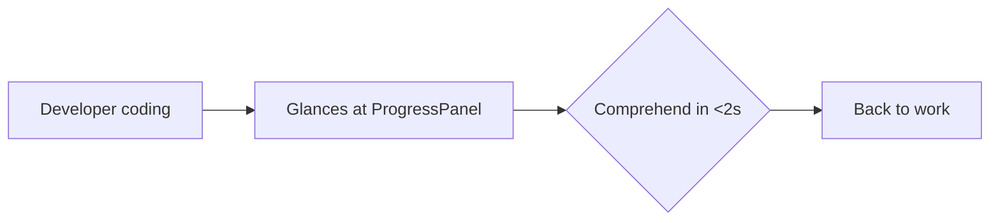
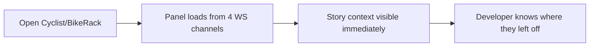

---
stepsCompleted:
  - step-01-init
  - step-02-discovery
  - step-03-core-experience
  - step-04-emotional-response
  - step-05-inspiration
  - step-06-design-system
  - step-07-defining-experience
  - step-08-visual-foundation
  - step-09-design-directions
  - step-10-user-journeys
  - step-11-component-strategy
  - step-12-ux-patterns
  - step-13-responsive-accessibility
  - step-14-complete
inputDocuments:
  - sprint/planning/prd.md
---

# UX Design Specification — ProgressPanel

**Author:** Keith Avery
**Date:** 2026-02-14

---

## Executive Summary

### Project Vision

A unified progress view that answers "where am I on this story?" in one glance — combining story context, workflow phase, acceptance criteria, todos, and git status into a single Cyclist panel.

### Target Users

Developers running Pennyfarthing agent workflows who currently flip between 4+ panels to understand story progress.

### Key Design Challenges

- Information density: 5 data sources must coexist without clutter
- Responsive sizing: narrow dockview slot to full-width standalone
- Partial data: graceful handling when story/AC/todos are not yet defined

### Design Opportunities

- Progressive disclosure: summary bar at top, expandable detail sections
- Synthesized progress: single visual indicator combining AC + todo completion
- Pattern consistency: reuse existing panel UI vocabulary (progress bars, badges, status icons)

---

## Core User Experience

### Defining Experience

A passive information radiator. The panel's default state answers "where am I on this story?" without any user interaction. Glance, comprehend, return to work.

### Platform Strategy

- **Cyclist:** Dockview panel slot (narrow sidebar or bottom strip)
- **BikeRack:** Standalone browser page via `?panel=progress`
- **Input:** Mouse/keyboard only, no touch optimization needed
- **Interaction model:** Primarily read-only; expand/collapse sections for detail

### Effortless Interactions

- Default view shows summary counts and status — no clicks to understand progress
- WebSocket push means data is always current with no user action
- Section expand/collapse is the only interaction, and it's optional
- Follows existing panel scroll/overflow patterns

### Critical Success Moments

- **The Glance:** Developer looks at panel, comprehends story state in <2 seconds
- **The Handoff:** Workflow phase changes, panel reflects it instantly
- **The Empty Start:** No story active — panel shows "No active story" cleanly

### Experience Principles

1. **Passive first** — the default state is the feature; interaction is optional
2. **Density over detail** — show counts and status, hide full lists behind expand
3. **Match the vocabulary** — same badges, progress bars, and status icons as existing panels
4. **Graceful degradation** — missing data collapses that section, doesn't break layout

---

## Design System Foundation

### Design System

Existing Cyclist design system: shadcn/ui + Tailwind v4 + Cyclist CSS custom properties (dark theme).

### Components Reused

| Component | Source | Usage |
|-----------|--------|-------|
| `Badge` | shadcn/ui | Workflow type, story status |
| `Separator` | shadcn/ui | Between sections |
| `Skeleton` | shadcn/ui | Loading state |
| `Tooltip` | shadcn/ui | Hover detail on counts |
| `.progress-bar-container` / `.progress-bar` | Cyclist CSS | AC and todo progress |

### No New Design Tokens

Zero new colors, spacing values, or typography. Everything from existing Cyclist theme variables.

---

## Visual Foundation

### Color System

Inherits Cyclist dark theme CSS variables:
- `var(--text-primary)` — story title, section headers
- `var(--text-secondary)` — meta info (points, branch name)
- `var(--text-muted)` — empty state messages
- `var(--accent)` — current phase highlight
- `var(--border)` — section separators
- `var(--status-error)` — if needed for blocked state

### Typography

- Section labels: `text-xs font-medium uppercase tracking-wider text-[var(--text-muted)]`
- Story title: `text-sm font-medium text-[var(--text-primary)]`
- Counts/meta: `text-xs text-[var(--text-secondary)]`
- Status icons: same `✓ ● ◯` vocabulary as AC/Todo/Workflow panels

### Spacing

- Panel padding: `p-2` (matches all existing panels)
- Section spacing: `space-y-2` between major sections
- Separator: `<Separator />` between story header and data sections

---

## Design Direction — Stacked Sections

### Layout

Vertical stack of 5 sections, top to bottom. No tabs, no accordion — just a scrollable column. Each section is compact (1-2 lines collapsed, expandable for detail).

### Wireframe (ASCII)

```
┌─────────────────────────────────┐
│ 98-17  Move server to core   8pt│  ← Story header (ID, title, points)
│ Epic 98 · keith.avery           │  ← Epic + assignee
├─────────────────────────────────┤
│ tdd  ◯ red → ● green → ◯ review│  ← Workflow: badge + phase dots
├─────────────────────────────────┤
│ AC   ████████░░  5/7            │  ← Progress bar + count
├─────────────────────────────────┤
│ Todo ██████░░░░  3/5  ● Running │  ← Progress bar + count + active
│                        tests    │
├─────────────────────────────────┤
│ Git  feat/98-17  4M 1U  ↑0 ↓2  │  ← Branch, dirty counts, ahead/behind
└─────────────────────────────────┘
```

### Empty State

```
┌─────────────────────────────────┐
│                                 │
│       No active story           │
│                                 │
│   Start a story with /sprint    │
│                                 │
└─────────────────────────────────┘
```

### Partial State (no AC, no todos)

```
┌─────────────────────────────────┐
│ 98-17  Move server to core   8pt│
│ Epic 98 · keith.avery           │
├─────────────────────────────────┤
│ tdd  ◯ red → ● green → ◯ review│
├─────────────────────────────────┤
│ Git  feat/98-17  4M 1U  ↑0 ↓2  │
└─────────────────────────────────┘
```

AC and Todo sections simply don't render when their data is empty/null. No "0/0" progress bars, no "No acceptance criteria" messages. The panel gets shorter.

---

## User Journey Flows

### Journey 1: Mid-Story Glance



### Journey 2: Workflow Phase Change

```mermaid
graph LR
    A[Agent hands off] --> B[/ws/story pushes new phase]
    B --> C[Workflow row updates: new phase highlighted]
    C --> D[Developer sees transition]
```

### Journey 3: Session Start



---

## Component Strategy

### Single Component: `ProgressPanel.tsx`

No sub-components needed. The panel is simple enough to be one file with inline sections.

### Structure

```typescript
export function ProgressPanel(): React.ReactElement {
  const { story, isLoading: storyLoading } = useStory();
  const { todos, isLoading: todosLoading } = useTodos();
  const { repos, isLoading: gitLoading } = useGitStatus();
  const { data: sprintData, isLoading: sprintLoading } = useSprint();

  const isLoading = storyLoading || todosLoading || gitLoading || sprintLoading;

  if (isLoading) return <ProgressPanelSkeleton />;

  const currentStory = sprintData?.currentStory;
  if (!currentStory && !story) return <EmptyState />;

  return (
    <div className="progress-panel" data-testid="progress-panel">
      <StoryHeader story={currentStory} storyDetail={story} />
      <Separator />
      {story?.workflowPhases && <WorkflowRow story={story} />}
      {story?.criteria?.length > 0 && <ACRow criteria={story.criteria} />}
      {todos.length > 0 && <TodoRow todos={todos} />}
      <Separator />
      <GitRow repos={repos} />
    </div>
  );
}
```

All `*Row` helpers are local to the file — not exported, not reusable. They're just JSX extraction for readability.

### CSS Classes

| Class | Purpose |
|-------|---------|
| `.progress-panel` | Root container |
| `.progress-panel.loading` | Loading state |
| `.story-header` | Story ID + title + points row |
| `.workflow-row` | Workflow badge + phase dots |
| `.ac-row` | AC progress bar + count |
| `.todo-row` | Todo progress bar + count + active task |
| `.git-row` | Branch + dirty counts + ahead/behind |
| `.placeholder` | Empty state |

### States

| State | Behavior |
|-------|----------|
| Loading | Skeleton grid matching section heights (`.space-y-2 p-2`) |
| Error | `.error-message` with error text (same as other panels) |
| Empty (no story) | Centered "No active story" + hint |
| Partial (no AC) | AC section doesn't render |
| Partial (no todos) | Todo section doesn't render |
| Full | All 5 sections visible |

---

## UX Consistency Patterns

### Progress Bars

Identical to ACPanel and TodoPanel:
```html
<div class="progress-bar-container">
  <div class="progress-bar" style="width: ${percentage}%"></div>
</div>
<span class="progress-text">${done}/${total}</span>
```

### Status Icons

Same vocabulary across all panels:
- `✓` — Done/complete
- `●` — Current/in-progress
- `◯` — Pending/future

### Badges

`<Badge variant="secondary">` for workflow type (tdd, bdd, trivial) — matches WorkflowPanel exactly.

### Phase Dots

Reuse WorkflowPanel's `.phase-step` pattern:
- `.phase-step.done` — completed phase
- `.phase-step.current` — active phase (accent color)
- `.phase-step.pending` — future phase (muted)

### Git Summary Format

Compact single line:
- Branch name (truncated if needed)
- `{N}M` modified, `{N}U` untracked (from repos[].modified, repos[].untracked)
- `↑{ahead} ↓{behind}` (from repos[].ahead, repos[].behind)

---

## Responsive Design & Accessibility

### Responsive Strategy

**Narrow dockview slot (200-300px):**
- All sections stack vertically, content wraps
- Branch name truncates with ellipsis
- Story title truncates with ellipsis
- Progress bars scale to container width

**Wide standalone (600px+):**
- Same layout — no breakpoint changes needed
- Content just has more room to breathe

**No breakpoints needed.** The panel is a vertical stack that works at any width. CSS handles truncation and wrapping naturally.

### Accessibility

- `data-testid` on root and each section for testing
- Progress bars have `aria-valuenow`, `aria-valuemin`, `aria-valuemax`
- Status icons have `aria-label` (e.g., "3 of 7 acceptance criteria complete")
- Section labels are `<h4>` or appropriate heading level
- Color is never the only indicator — icons + text accompany all status

---

## Implementation Notes for Dev

### Hooks (4 existing, no new ones)

| Hook | What to extract |
|------|----------------|
| `useStory()` | `story.id`, `story.title`, `story.phase`, `story.workflowPhases`, `story.criteria` |
| `useTodos()` | `todos` array, filter by status for counts |
| `useGitStatus()` | `repos` array — branch, modified, untracked, ahead, behind |
| `useSprint()` | `data.currentStory` — id, title, points, epic, status |

### Registration

1. Export from `panels/index.ts`
2. Add to dockview layout default config
3. Add to BikeRack `PANEL_REGISTRY` in `StandalonePanel.tsx`

### Estimated Size

~150-200 lines including all row helpers, loading skeleton, and empty state. Single file, no dependencies beyond existing hooks and shadcn/ui.
